# eBPFLens 運用マニュアル

[English](manual.md)

読み手は当番の人です。能力はあるが、カーネルの専門家ではなく、いま忙しい人。eBPFLens に何が見えるのか、各画面が何を意味するのか、黄色や赤になったら何をすればよいのかを書きます。設計の背景は [ADR 0001](adr/0001-everyone-an-sre.md)、ビルドと配置は [README](../README.ja.md) にあります。

## 1. 5 分で分かる eBPFLens

eBPFLens は Linux ホストをカーネルの中から eBPF で見て、見えたものを平易な文に変えます。**何かおかしいか**、**何が**、**誰のせいで**、**誰が困っていて**、**何をすべきか**。平均値をポーリングするのではなく、スケジューラの切り替え・メモリ回収の停止・プロセスの起動と終了・OOM kill・終了シグナルをすべて数えるので、ポーリングの隙間で起きたことも拾えます。

ダッシュボード(`http://<server>:8080`)を開いて、上から読みます。

1. **Lens Summary** — レベルと見出しの 1 行(例: *警告 · CPUの取り合いが起きています*)、その下に領域ごとの 1 行: **CPU**、**メモリ**、**プロセス**、**VM**。
2. **直近の出来事** — 24 時間以内に起きたことを新しい順に。
3. **資源ごとの状態** — 資源 × *使用率 / 飽和 / エラー* の升目。どの升目も詳細画面へのリンクです。

見出しが緑なら、あなたの出番はありません。緑でなければ、見出しが領域を、その下の行が何が起きたか(分かれば理由も)を言っています。根拠は升目かメニューから詳細画面へ。

言語は上部バーの **EN / 日本語**。ホストは上部バーの選択(1 台のサーバーで複数ホストを見られます)。

## 2. 導入と配置

### 必要なもの

- **監視対象のホスト**: カーネル BTF のある Linux(`/sys/kernel/btf/vmlinux` がある。Ubuntu、Fedora、RHEL 9、Debian 12 以降は標準で入っています)。検証は Ubuntu 26.04 / カーネル 7.0。エージェントは glibc 2.34 以降(Ubuntu 22.04、Debian 12、RHEL 9 以降)にリンクした 1 本のバイナリで、ホストに他に入れるものはありません。GPU のプロセス別の内訳と DNS の 2 つは multi-uprobe の BPF リンクを使うので**カーネル 6.6 以上**が要ります。古いカーネルでもエージェントは動き、その 2 つが出ないだけです。GPU の画面には NVIDIA のドライバも要り、無ければ GPU の行が出ないだけです。
- **ビルド機**(同じアーキテクチャで、監視対象と同じかそれより古いディストリ。バイナリがビルド機の glibc にリンクされるため): Go 1.25+、clang、llvm、libbpf-dev、bpftool、**gcc**(GPU のプローブが使う公式の NVML バインディングのための cgo。NVIDIA のヘッダーが出す非推奨の警告は Makefile で抑えています)。画面は Node 22 で一度ビルドしてサーバーのバイナリに埋め込むので、ブラウザ側に必要なものはありません。
- **サーバー**: 各ホストから TCP 1 ポート(既定 8080)で届く Linux。監視対象の 1 台を兼ねてもかまいません。SQLite 内蔵で、データベースのサービスは不要です。
- **ネットワーク**: エージェント → サーバー `:8080`(HTTP)、ブラウザ → サーバー `:8080`。認証はありません(7 章)。このポートは信頼できるネットワークの中に置くか、認証を足すリバースプロキシの後ろに置いてください。

### ビルド

```bash
git clone https://github.com/y6ui3i/ebpf-lens && cd ebpf-lens
make web      # Node のある機械で。TS の型を生成し、画面を internal/webui/dist にビルド
make build    # Linux で。このカーネルの BTF から vmlinux.h → BPF オブジェクト → bin/ebpflens-agent と bin/ebpflens-server
```

`bin/` に 2 つのバイナリができます。`ebpflens-agent` は監視したいホストすべてにコピー、サーバーは決めた場所へ。

### サーバーの配置(systemd)

サーバー機で、リポジトリの中から:

```bash
sudo useradd --system --no-create-home --shell /usr/sbin/nologin ebpflens
sudo usermod -aG ebpflens "$USER"            # 任意: sqlite3 で DB を読めるようにする
make install                                 # /opt/ebpflens/bin/* と /etc/systemd/system/ebpflens-{server,agent}.service
sudo systemctl enable --now ebpflens-server
```

ユニットはサーバーを特権なしの `ebpflens` ユーザーで動かし、`:8080` で待ち受け、DB は `/var/lib/ebpflens/ebpflens.db`(サンプル 24 時間、イベント 7 日、出来事 30 日)。DB を別のディスクに置くなら drop-in を足します。NFS には置かないでください。

```ini
# /etc/systemd/system/ebpflens-server.service.d/10-local-db.conf
[Unit]
RequiresMountsFor=/data/ebpflens
[Service]
ExecStart=
ExecStart=/opt/ebpflens/bin/ebpflens-server -addr :8080 -db /data/ebpflens/ebpflens.db
ReadWritePaths=/data/ebpflens
```

しきい値の変更や通知の追加は、同じ `ExecStart` にフラグを足します(`-triggers /etc/ebpflens/triggers.json`、`-webhook https://… -webhook-format slack`。8 章参照)。そのあと `sudo systemctl daemon-reload && sudo systemctl restart ebpflens-server`。

### 各ホストへのエージェント配置(systemd)

監視対象の各ホストで:

```bash
sudo useradd --system --no-create-home --shell /usr/sbin/nologin ebpflens
sudo install -d /opt/ebpflens/bin
sudo install -m 0755 ebpflens-agent /opt/ebpflens/bin/
sudo install -m 0644 deploy/systemd/ebpflens-agent.service /etc/systemd/system/
sudo systemctl daemon-reload
```

ユニットの `ExecStart` の `-server` を自分のサーバーに向け(`-server http://SERVER:8080`。同梱のユニットはサーバーが同じ機械にある前提です)、`sudo systemctl enable --now ebpflens-agent`。エージェントは `ebpflens` ユーザーで、`CAP_BPF` と `CAP_PERFMON` だけを持って動きます。root ではありません。ホストはダッシュボードのホスト選択にホスト名で現れます(`-host 名前` で上書き可)。1 台のサーバーで多数のホストを見られ、各ホストのエージェントは互いに独立です。報告が止まったホストは 30 秒で「エージェント停止」の出来事になります。

### 動作確認

```bash
systemctl status ebpflens-server ebpflens-agent
journalctl -u ebpflens-agent -n 20            # "load bpf objects" のエラーが出ていないこと
curl -s http://SERVER:8080/api/hosts          # 各ホストと最終サンプル時刻
```

`http://SERVER:8080` を開くと、数秒で Lens Summary が緑になり、CPU の行にマイクロ秒の待ち時間が出ます。ホストが出てこないときは、エージェントが動いていない、サーバーに届いていない、カーネルに BTF がない、のどれかです(エージェントのログに出ます)。

### 更新

新しいバイナリをビルドし、サーバーでは `make install && sudo systemctl restart ebpflens-server`、各ホストでは新しいエージェントを `/opt/ebpflens/bin/` にコピーして `sudo systemctl restart ebpflens-agent`。出来事と履歴はサーバーの再起動をまたいで残ります(開いていた出来事の扱いは 5 章)。

### 削除

`sudo systemctl disable --now ebpflens-agent`(サーバーは `ebpflens-server`)、`/opt/ebpflens`・ユニット・`/var/lib/ebpflens`(DB)・`ebpflens` ユーザーを削除。エージェントはホストに他に何も残しません。eBPF のプログラムは停止時に外れます。

## 3. ダッシュボードの読み方

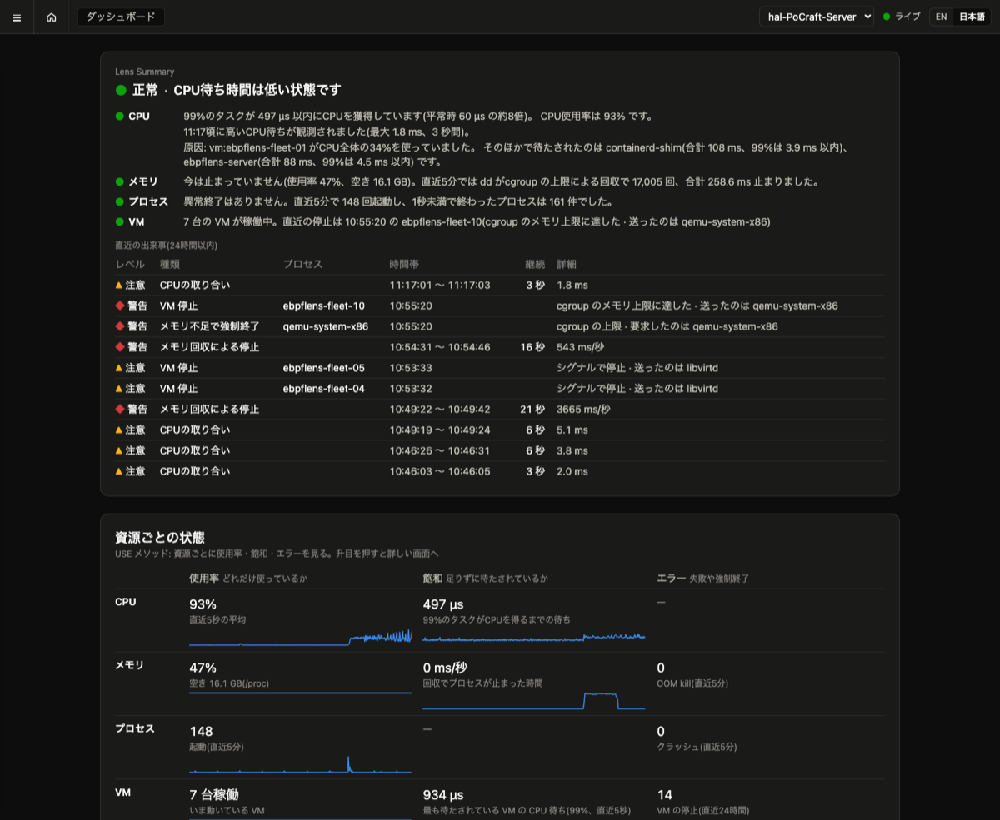

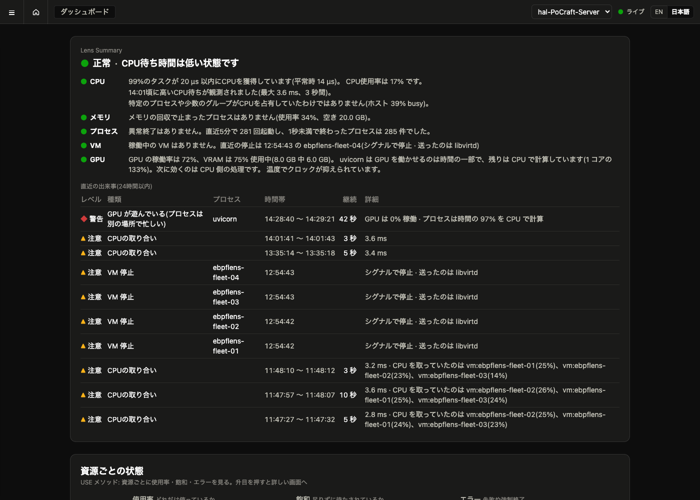


### レベル

| 印 | レベル | 意味 |
|---|---|---|
| ● | 正常 | 平常の範囲内 |
| ▲ | 注意 | 見ておく価値がある。しきい値を数秒超えた、または異常だが致命的ではないことが起きた |
| ◆ | 警告 | 動く。しきい値をしばらく超えた、プロセスが殺された・クラッシュを繰り返している、ホストや VM が止まった |

全体のレベルは**最も悪い領域**です。見出しの優先順位は、報告が止まったホスト → VM → CPU → メモリ → プロセスの順。エージェントが沈黙していれば他の値は古く、VM の停止はプロセスのクラッシュより重いからです。

### 所見の行

- **CPU** — 「99%のタスクが 30 µs 以内にCPUを獲得しています(平常時 29 µs)。CPU使用率は 1% です。」最初の数字は直近 5 秒の実行待ち p99: *実行できる状態になった* タスクが CPU を得るまで待った時間です。「平常時」は表示範囲の落ち着いた秒の中央値。直近に取り合いがあれば、2 文目がいつ・何秒・最大を、3 文目が原因(「stress-ng-cpu(32プロセス)がCPU全体の93%を使っていました」)と被害側(「そのほかで待たされたのは steam(合計 437 ms、99%は 989 µs 以内)」)を言います。
- **メモリ** — いま回収で止まっているプロセスがあるか(メモリを要求したプロセスが、カーネルが空きを作る間止められる)、それに /proc からの使用率と空き。直近 5 分に止まったものがあれば、誰がどれだけかも。
- **プロセス** — 直近の OOM kill、クラッシュの繰り返し、クラッシュ。なければ起動数と、1 秒未満で終わった数。
- **VM** — 直近の VM の停止と原因、または稼働中の台数。
- **ディスク** — ブロック I/O の 99% が完了するまでの時間、転送量、I/O を主に出しているのは誰か。直近 5 分に失敗した I/O があればそれも。
- **ネットワーク** — 1 秒あたりの接続数と、99% が確立するまでの時間。直近 5 分の失敗した接続と再送、それが主にどの宛先か。
- **GPU**(NVIDIA の GPU があるホストだけ)— GPU の稼働率と VRAM の使用量、そして一番忙しい CUDA プロセスが時間を何に使っているか: GPU を働かせている、転送している、CPU で計算している、別の何かを待っている、モデルを載せたまま何もしていない。クロックが抑えられていれば(電力上限、温度)そう言います。

### 送る報告文

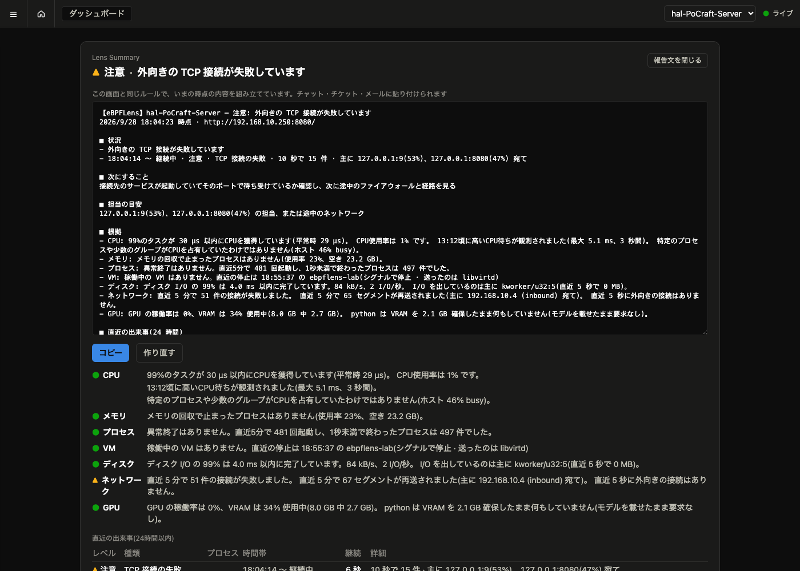

**送る報告文**(Lens Summary の右上、VM のページにも)は、いまの時点の内容を、チャット・チケット・メールにそのまま貼れる文章にします。**状況**(見出しといま起きていること)、理由付きの**次にすること**、**担当の目安**(アプリケーション / インフラ / ハードウェア / ネットワーク / 人の操作。ルールで決められなければ*不明*)、**根拠**(所見の行)、日付付きの直近の出来事。画面と同じ固定のルールで組み立て、推測はしません(ADR 0001)。*コピー*は HTTP でも動きます。ブラウザのクリップボード API は HTTPS が必要なので、LAN では文章を選択して昔ながらの方法でコピーします。

### 直近の出来事

1 行が 1 件: レベル、種類、プロセス/VM、時間帯(または *継続中*)、継続時間、種類ごとの詳細(最大待ち、ms/秒、シグナル、OOM の範囲と引き金、クラッシュ回数、誰がシグナルを送ったか)。継続中の出来事には終了時刻がありません。種類の一覧は 5 章に。

### 資源ごとの状態(USE)

Brendan Gregg の USE メソッドに倣い、資源ごとに 3 つの問いを立てます。

| 列 | 問い | 升目の例 |
|---|---|---|
| **使用率** | どれだけ使っているか | CPU %、メモリ %、プロセスの起動数、稼働中の VM 数、ディスクの転送量、接続/秒、GPU 稼働率 |
| **飽和** | 足りずに待たされているものがあるか | CPU 待ち p99、回収で止まった ms/秒、最も待たされている VM、ディスクの待ち時間 p99、接続 p99、VRAM 使用率 |
| **エラー** | 失敗や強制終了があったか | OOM kill、クラッシュ、VM の停止、ディスクの I/O エラー、失敗した接続と再送、GPU のクロック抑制 |

升目には最新値、5 分のスパークライン、異常時だけレベルの印。「未実装(ロードマップ n)」はまだ作っていないものです。

## 4. 各画面

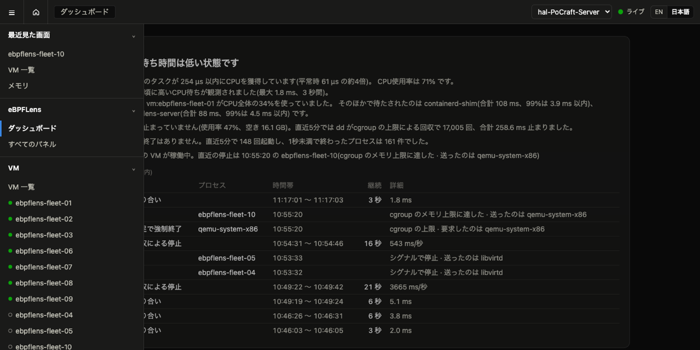


メニュー(☰)は 3 グループ: **eBPFLens**(ダッシュボード、すべてのパネル)、**VM**(VM 一覧、VM ごと)、**ホスト**(CPU実行待ち時間、プロセスの起動と終了、メモリ。ディスク・ネットワーク・GPU は準備中)。

### CPU実行待ち時間(`/cpu`)

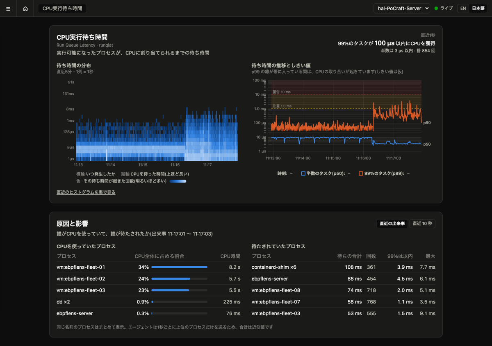


*何か。* 実行できるタスクが CPU を得るまで待った時間。落ち着いた 8 コア機では p99 が数十 µs、4 倍の割り当て過多では 8〜16 ms。この待ちは CPU 使用率のグラフには出ません。70% のホストでも、同時に実行可能になるタスクの組み合わせ次第でミリ秒待たせます。

*見えるもの。*
- **待ち時間の分布** — ヒートマップ。横が時刻(直近 5 分、1 列 1 秒)、縦が待ち時間(対数、上ほど長い)、色が回数。取り合いは、明るい帯が 8 µs の行から 8 ms の行へ飛ぶ形で見えます。
- **待ち時間の推移** — p50 と p99 に、注意(1 ms)と警告(10 ms)の帯。p99 が帯の中にある間、CPU の取り合いが起きています。
- **原因と影響** — 直近の出来事(なければ直近 10 秒)について、CPU を*使っていた*側(ホスト全体に占める割合)と*待たされた*側(合計、回数、p99、最大)の 2 表。「原因」は単独でホストの 30% 以上を使うプロセス。25% ずつの隣人が 3 つの場合は被害側だけが出ます(既知の穴、7 章)。

*読み方。* 一番待たされているプロセスが、利用者が体感しているものです。大きく使って少ししか待たないのは占有者、少ししか使わず大きく待つのは被害者。EEVDF はよく眠るタスク(対話的なもの)を起床時に優遇するので、被害者の待ちは占有者より 1 桁小さいのが普通です。16 ms の嵐の中で、応答を待たせたくないデーモンの p99 が 1 ms、というのが「守られてはいるが無傷ではない」姿です。

### プロセスの起動と終了(`/processes`)

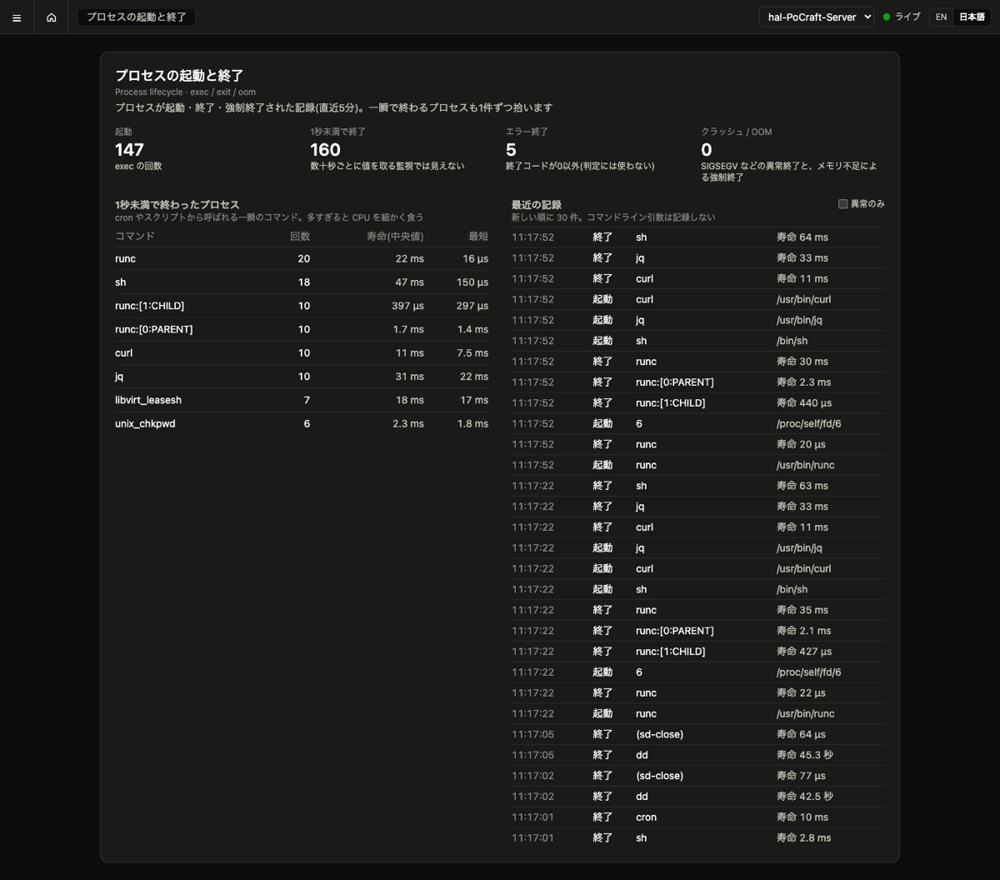


*何か。* ホスト上のすべての exec・exit・OOM kill・終了シグナルを、カーネルから。1 ミリ秒しか生きないプロセスも含みます。コマンドライン引数は意図的に**記録しません**(パスワードが入りうるため)。

*見えるもの。* 4 つの数字(起動、1 秒未満で終了、エラー終了、クラッシュ + OOM)、異常な終わり方の表、短命コマンドの上位(cron やスクリプトの雑音。fork 爆弾も)、「異常のみ」で絞れる生のイベントの記録。

*読み方。* **OOM kill** の行は範囲(ホスト全体か cgroup の上限か)と、*どのプロセスのメモリ要求が引き金だったか* を言います。引き金は被害者と別のことが多い。**クラッシュ**は SIGSEGV/SIGABRT/SIGBUS/SIGFPE/SIGILL/SIGSYS かコアダンプ付きの終了。SIGTERM/SIGKILL はクラッシュではなく、誰かが止めたということです。**シグナル**の行は、誰が誰に SIGTERM/SIGKILL/SIGINT/SIGHUP/SIGQUIT を送ったかです。

### メモリ(`/memory`)

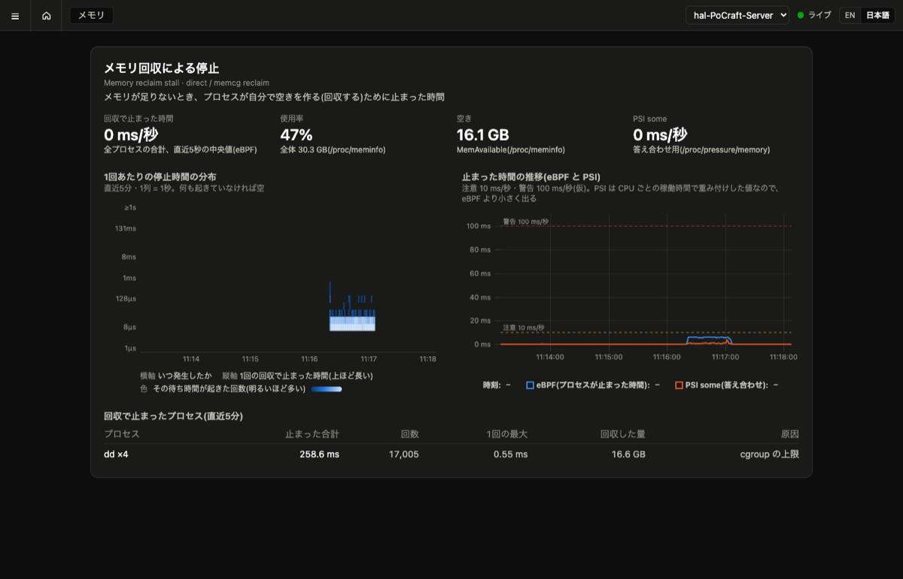


*何か。* プロセスがメモリ回収で止まった時間。メモリを要求した瞬間に、カーネルが空きを作る間だけ待たされる、その時間です。eBPF でプロセスごとに数えます(ホスト全体の不足なら direct reclaim、cgroup の上限なら memcg reclaim)。使用率と PSI は /proc から、答え合わせのためだけに。

*見えるもの。* 数字(ms/秒、使用率、空き、PSI)、停止時間の分布のヒートマップ、eBPF の停止と PSI の推移、止まったプロセスと原因(cgroup の上限かホストの不足か)。

*読み方。* 使用率だけでは問題ではありません。止まっているかどうかが問題です。**cgroup の上限**で止まるプロセスは、自分の上限に当たったコンテナや VM で、直すのはその上限であってホストではない。ホスト全体の停止は、機械が足りないということ。1 つのプロセスだけが止まり他の CPU が動いていると、PSI は eBPF より小さく出ます。それは想定どおり(PSI は CPU 時間で重み付けする)で、目安は「*誰が* はプロセス別の数字、*機械全体* は PSI」です。

*ページフォールトとスワップ。* 画面の 2 つ目の節です。minor fault(ただ)、major fault(ページがディスクから来た)はプロセスごとに時間を計り、スワップからのものを分けます。スワップの大きさと出入りのページ数は `/proc` からの答え合わせ。読むべきは **major fault の停止**: 毎秒 100 ms なら、プロセスが自分のメモリがディスクから戻るのを待っています。**スワップから**の列が、そのメモリがスワップに出されていたのか(ホストのメモリが尽きた)、追い出されたファイルのページを読み直しているのか(ワーキングセットが収まらない、または起動直後)を示します。

### VM(`/vms` と `/vms/<名前>`)

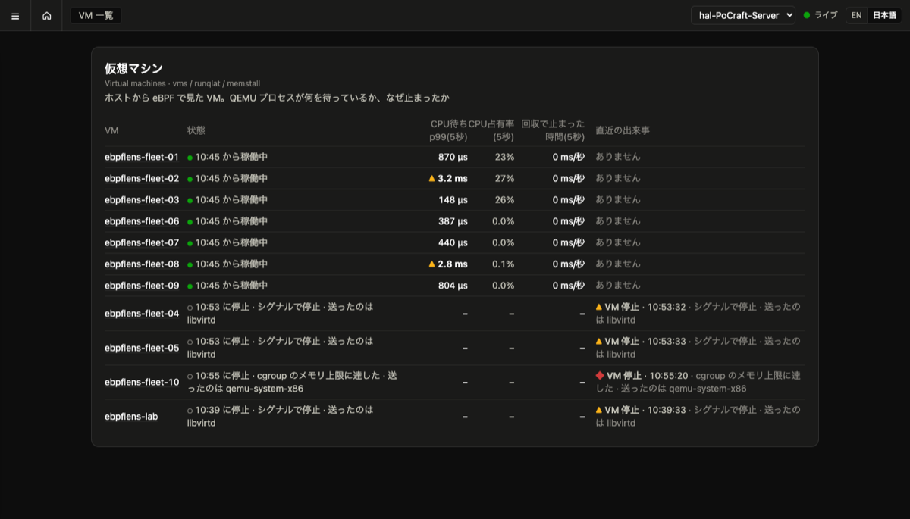


*何か。* ホストから見た KVM のゲスト。eBPFLens は QEMU プロセスを見分ける(libvirt と Proxmox の命名)ので、VM ごとの CPU 待ちと回収停止がその名前で集計され、VM の死はホスト側の証拠から説明されます。ゲストの中にエージェントは要りません。libvirt へのアクセスも要りません。

*VM 一覧。* 2 つの節があります。**稼働中**(と、注意が要る VM: 5 分以内に停止した、またはいまホストの CPU を待っている)と、**停止 (N)**。停止の節は既定で閉じていて、クリックで開きます(稼働中が 1 台もなければ自動で開く)。行の中身: 状態(いつから稼働 / いつ停止 · 原因)、ホスト側の CPU 待ち p99、ホスト CPU の占有率、回収停止、直近の出来事。

*止まった VM のその後。* ホストからは停止と削除を区別できないので、時間で決めます。停止から 5 分はレベルの印付きでメニューに、1 時間はメニューの **停止 (N)** の折り畳みに、24 時間は一覧の停止の節に、その後はどちらからも消えます。ページ(`/vms/<名前>`)は DB が 30 日持つ出来事から引き続き答えます。同じ名前で起動し直せば*稼働中*に戻り、前の停止はそのページの履歴になります。

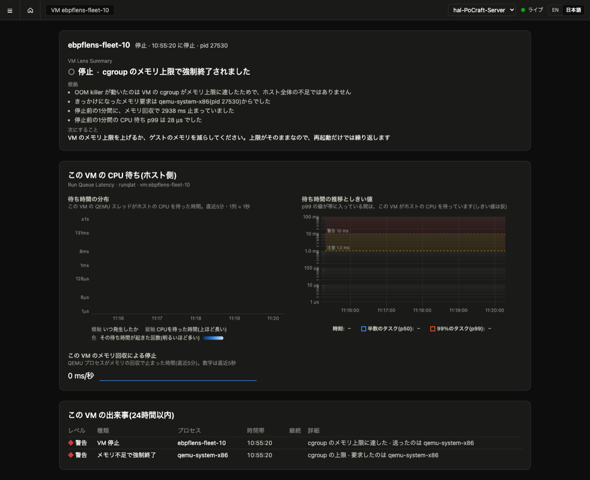

*VM のページ。* **VM Lens Summary**:
- **原因ごとの見出し** — *cgroup のメモリ上限で強制終了されました*、*ホストの OOM killer に強制終了されました*、*QEMU がクラッシュしました*、*シグナルで停止しました*、*正常に終了しました*、または *稼働中*。
- **根拠** — ある事実だけ: 誰がシグナルを送ったか、どのメモリ要求が OOM の引き金で、上限は VM の cgroup かホストか、シグナルとコアダンプ、VM の最後の 1 分(回収停止、CPU 待ち p99)。
- **次にすること、理由付き** — 例: *VM のメモリ上限を上げるか、ゲストのメモリを減らしてください。上限がそのままなので、再起動だけでは繰り返します。*

その下に、この VM 自身の CPU 待ちのヒートマップと推移(ホスト側 — 分布付きの steal time です)、回収停止、この VM の出来事。

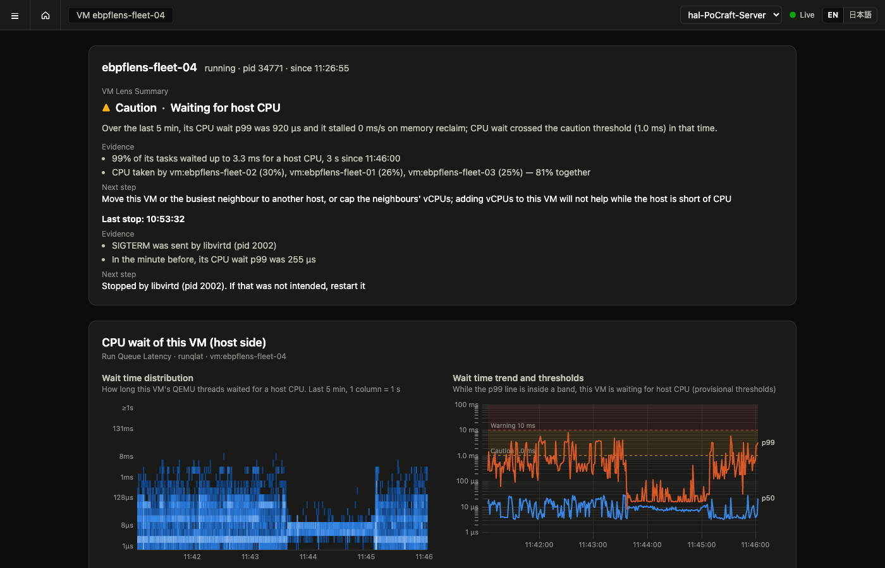

*読み方。* 稼働中の VM で、自分の CPU 占有率は小さいのに待ち p99 が 1 ms を超えているなら、**うるさい隣人の被害者**です。その VM の `vm_cpu_wait` の出来事と「この VM の CPU を取っていたのは誰か」の表が相手を名指しします。死ぬ前に回収で止まっていた VM は、上限にぶつかって身動きが取れなくなっていたということ。ホストにスワップがあると、上限は VM を殺さず、遅くします。

### ディスク(`/disk`)

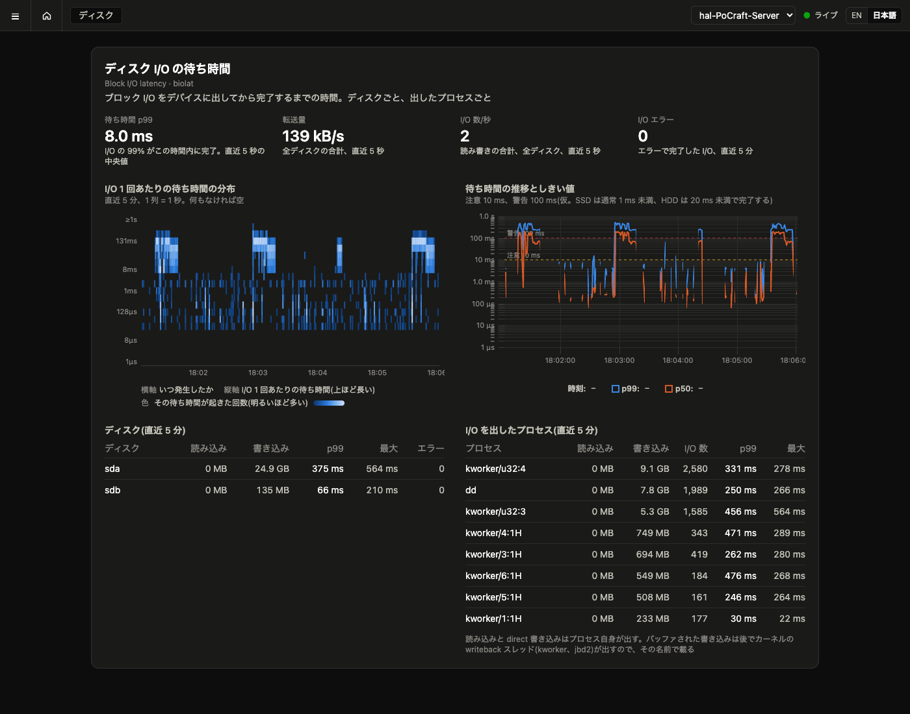

*何か。* ブロック I/O を 1 件ずつ、デバイスに出してから完了するまで計ったもの(block の tracepoint に eBPF)。待ち時間のヒストグラム、ディスクごと(I/O 数、バイト数、最大待ち時間、エラー)、出したプロセスごとの 3 通りで持ちます。

*見えるもの。* タイル(待ち時間 p99、転送量、I/O 数/秒、エラー)、I/O 1 回あたりの待ち時間のヒートマップ、注意・警告の線付きの p50/p99 の推移、ディスクの表、I/O を出したプロセスの表。

*読み方。* p99 はキュー待ち + デバイスの時間です。p99 が上がっていて、1 つのプロセスがバイトの大半を出していれば、そのプロセスがディスクを飽和させています。絞るか移す(ionice、別のディスク、時間帯)。トラフィックが少ないのに p99 が上がっていればデバイス自身。エラーの列を見て、`dmesg` と SMART へ。バッファされた書き込みはカーネルの writeback スレッド(`kworker`、`jbd2`)が出すのでその名前で載り、読み込みと direct 書き込みはプロセスに帰属します。全速の順次 direct 書き込みはそれだけで p99 が高くなります。キューが深いからで、ディスクが壊れているからではありません。しきい値は仮で、ホストごとに合わせるもの。

### ネットワーク(`/network`)

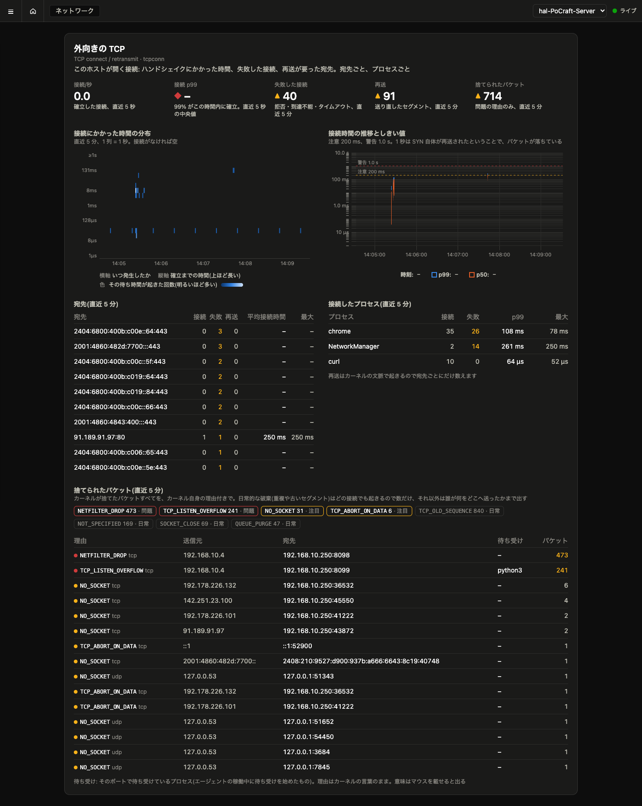

*何か。* ソケットの状態遷移から見た外向きの TCP。接続ごとに確立までかかった時間、失敗した接続、再送が要った宛先。宛先ごと、プロセスごと。

*見えるもの。* タイル(接続/秒、接続 p99、失敗した接続、再送)、接続時間のヒートマップ、注意・警告の線付きの p50/p99 の推移、宛先の表、接続したプロセスの表。

*読み方。* **失敗**した接続は相手か経路です。拒否(そこで何も待ち受けていない)、到達不能、タイムアウト。ある宛先への**再送**はその経路のパケットロスか輻輳。「addr のクライアント」への再送は、このホストに*入ってくる*接続でのもの。**接続 p99 がちょうど 1 秒や 3 秒**ならロスの証拠です。最初の SYN が落ちて 1 秒(次は 3 秒)のタイムアウト後に再送されたので、その値で「遅い」宛先は遠いのではなく落ちる経路にあります。再送は宛先ごとにだけ数えます。カーネルがプロセスの文脈なしに行うので。

*捨てられたパケット。* 最後の節は、カーネルが捨てたパケットすべてをカーネル自身の理由付きで、3 段に分けて出します。**日常**(重複や古いセグメント、データが残ったまま閉じたソケット。どの接続でも起きるので数だけ)、**注目**(`NO_SOCKET`: 誰も待ち受けていないポートへのパケット、`TCP_RESET`……)、**問題**(`TCP_LISTEN_OVERFLOW`: accept 待ち行列が満杯、`NETFILTER_DROP`: ファイアウォールのルール、`IP_OUTNOROUTES`: 経路がない、`QDISC_DROP`: インターフェースの飽和、`NOMEM`……)。注目と問題の行には送信元アドレス、宛先アドレスとポート、プロトコル、そしてエージェントの稼働中に待ち受けを始めたポートなら**待ち受け**プロセスが付きます。理由にマウスを載せると意味が出ます。「捨てられたパケット」のタイルは問題の段だけを数えます。

### DNS(`/dns`)

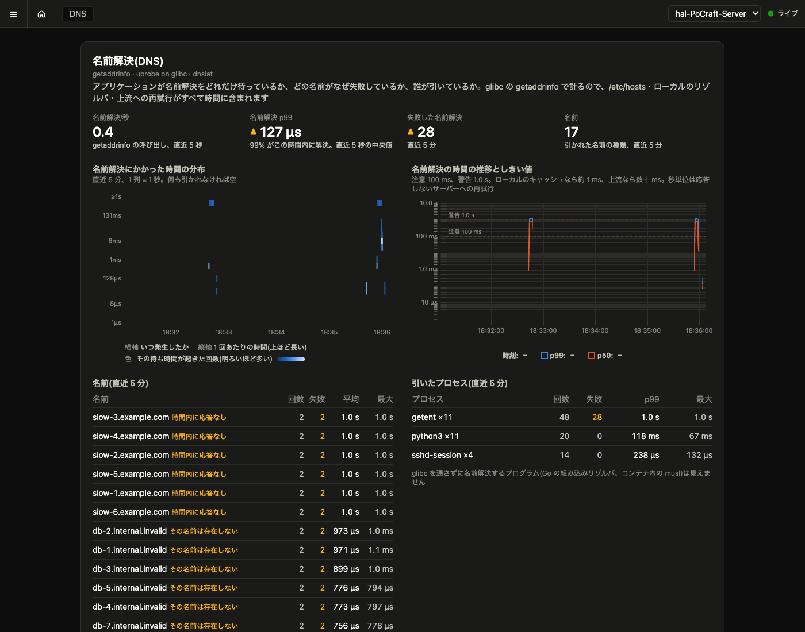

*何か。* アプリケーションから見た名前解決。glibc の `getaddrinfo` への uprobe で、名前・呼び出しにかかった時間・結果を 1 件ずつ記録します。`/etc/hosts`、ローカルのキャッシュ、上流への再試行はすべて時間に含まれます。

*見えるもの。* タイル(名前解決/秒、名前解決 p99、失敗した名前解決、名前の種類)、名前解決の時間のヒートマップ、注意・警告の線付きの p50/p99 の推移、名前の表(最後の失敗のエラー付き)、引いたプロセスの表。

*読み方。* **その名前は存在しない**(`EAI_NONAME`)は名前の誤りか廃止、レコードの欠落。設定かゾーンを直します。**時間内に応答なし**(`EAI_AGAIN`)は DNS サーバーが落ちているか届かない。ローカルのキャッシュなら約 1 ms、上流なら数十 ms。p99 が**秒単位**なら、応答しないサーバーへの再試行です。glibc を通さずに名前解決するプログラム(Go の組み込みリゾルバ、コンテナ内の musl)は見えません。

### ファイル(`/files`)

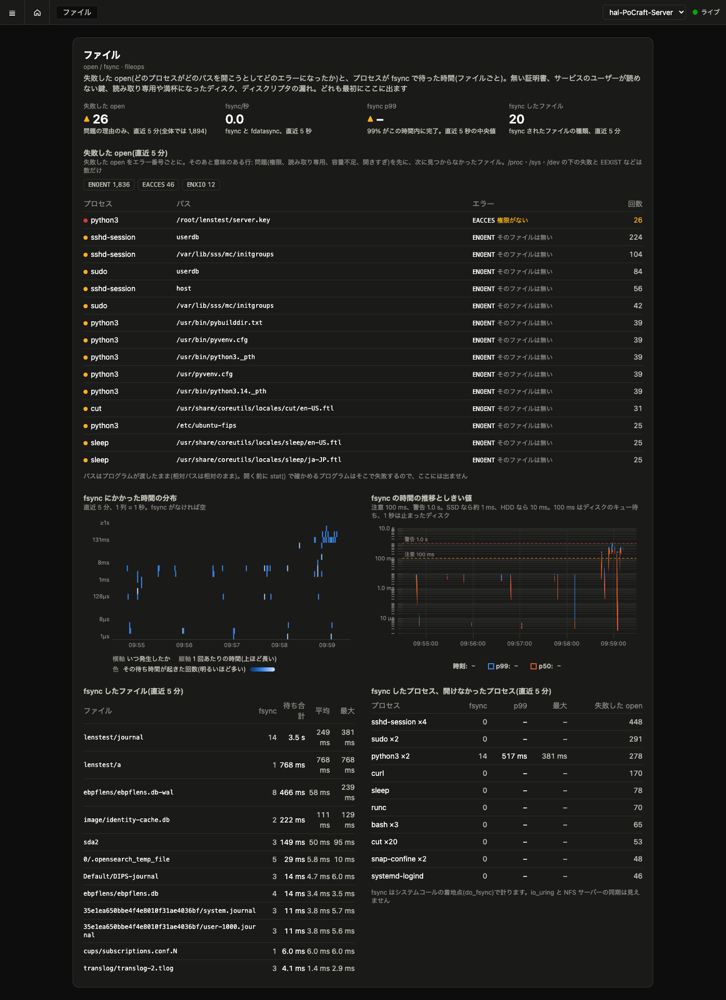

*何か。* カーネルの中から見たファイルの 2 つのこと。失敗した open(`open` / `openat` / `openat2` の生の syscall tracepoint: プロセス、パス、errno)と fsync の待ち(`do_fsync`: どれだけ、プロセスごと・ファイルごと)。

*見えるもの。* タイル(問題の段の失敗した open、fsync/秒、fsync p99、fsync したファイルの種類)、エラー別のチップと行(問題を先に、次に見つからなかったファイル)、fsync の時間のヒートマップ、注意・警告の線付きの p50/p99 の推移、fsync したファイル、fsync した・開けなかったプロセス。

*読み方。* **エラーが直し方を示します**。`EACCES` / `EPERM` は所有者・モード・AppArmor(`ls -l`、サービスのユーザー)。`EROFS` は読み取り専用になったマウント(`dmesg`)。`ENOSPC` は満杯のディスク。`EMFILE` / `ENFILE` はディスクリプタの漏れか上限(`ls /proc/<pid>/fd | wc -l`)。`ENOENT` の行は「nginx が /etc/ssl/certs/x.pem を見つけられない」を画面に出すために表示しますが、出来事にはしません。プログラムは一日中、あるかどうか分からないファイルを探しているからです。`/proc`、`/sys`、`/dev` の下の失敗は数だけ。**fsync p99** の 100 ms はディスクのキュー待ち、1 秒は止まったディスクです。ファイルの表がどのファイルに時間がかかったかを、同じ時刻のディスク画面がなぜディスクが遅かったかを示します。

### ロック(`/locks`)

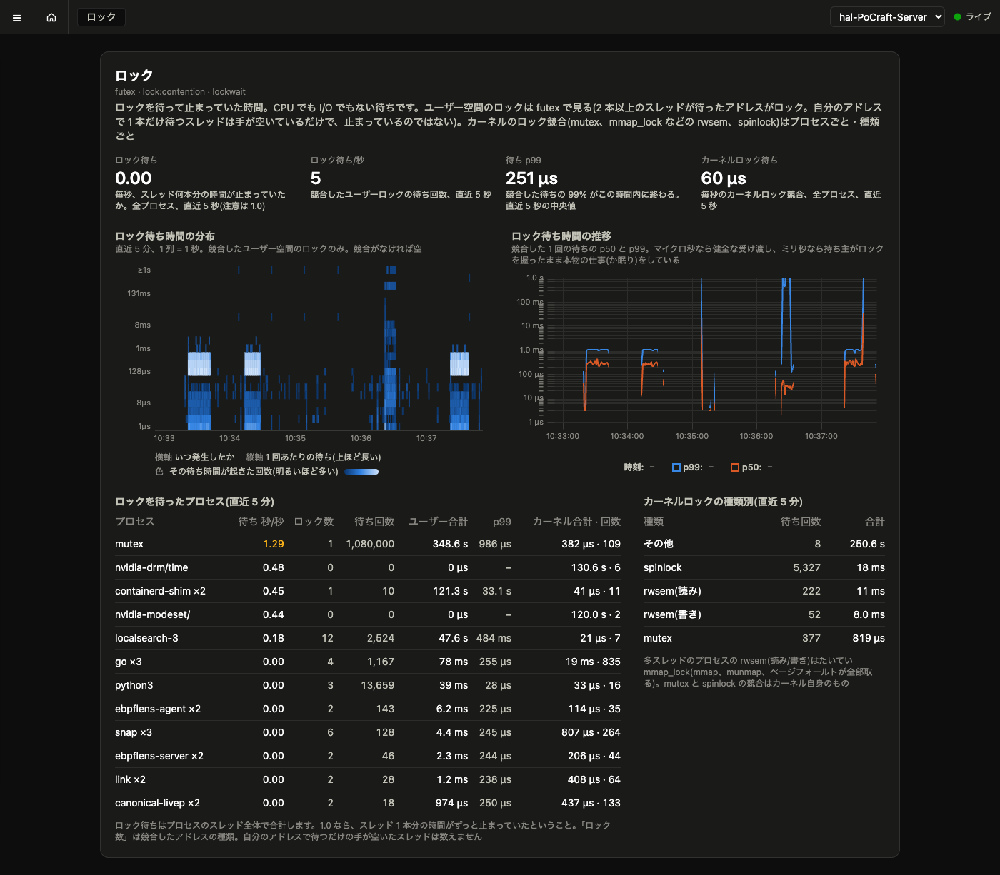

*何か。* ロックを待って止まっていた時間。CPU でも I/O でもない待ちです。ユーザー空間のロックは futex で(2 本以上のスレッドが待ったアドレスがロック。自分のアドレスで 1 本だけ待つスレッドは手が空いているだけで、止まっているのではない)、カーネルのロック競合(mutex、rwsem、spinlock)はプロセスごと・種類ごと。

*見えるもの。* タイル(毎秒スレッド何本分の時間がロック待ちだったか、競合した待ちの回数/秒、待ち p99、カーネルロック待ち)、競合した 1 回の待ちのヒートマップと p50/p99 の推移、待ったプロセス(ユーザー / カーネルの内訳と競合したロック数)、カーネルロックの種類別。

*読み方。* 読むべき数字は **待ち 秒/秒**。1.0 ならスレッド 1 本分の時間がずっと止まっていたということで、7.0 のプロセスはどの瞬間も 7 本が待っていて、CPU を足しても効きません。マイクロ秒の待ちが高頻度ならロックを手早く回している(CPython の GIL: 毎秒 27 万回、約 5 µs)。ミリ秒の待ちなら、持ち主が握ったまま本物の仕事(か眠り)をしています。多スレッドのプロセスの **rwsem(読み)/ rwsem(書き)** はたいてい `mmap_lock`。mmap、munmap、ページフォールトが全部取るので、同時に確保する多数のスレッドが競合します。

### 割り込み(`/irq`)

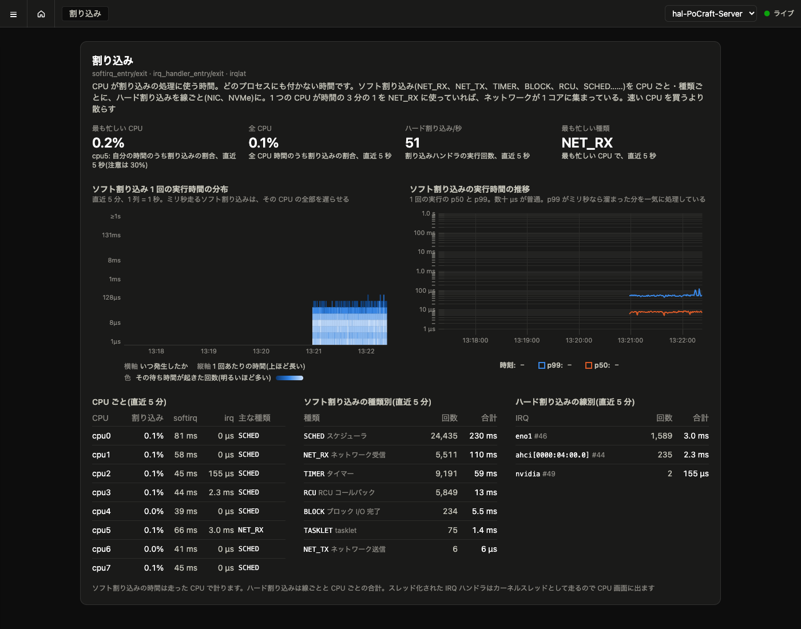

*何か。* CPU が割り込みの処理に使う時間。どのプロセスにも付かない時間です。ソフト割り込みを CPU ごと・種類ごと(NET_RX、NET_TX、TIMER、BLOCK、SCHED、RCU……)、ハード割り込みを線ごと(ハンドラ名: NIC、NVMe)に。

*見えるもの。* タイル(最も忙しい CPU の割り込みの割合、全 CPU での割合、ハード割り込み/秒、最も忙しい種類)、ソフト割り込み 1 回の実行時間のヒートマップと p50/p99 の推移、CPU ごとの表(割合、softirq と hardirq の時間、主な種類)、ソフト割り込みの種類別、ハード割り込みの線別。

*読み方。* 割合が高く主な種類が NET_RX の CPU が 1 つあれば、ネットワークが 1 コアに集まっています。全パケットがそこで処理され、同じコアで動くほかの全部が待ちます。直すのは割り込みを散らすこと(NIC の RSS / 複数キュー、RPS、irqbalance)で、速い CPU ではありません。ソフト割り込みの**実行時間**の p99 がミリ秒なら、溜まった分(パケットの束、ブロック I/O の完了)を一気に処理していて、その CPU の全部に遅延として見えます。スレッド化された IRQ ハンドラはカーネルスレッドとして走るので CPU 画面に出ます。

### GPU(`/gpu`)

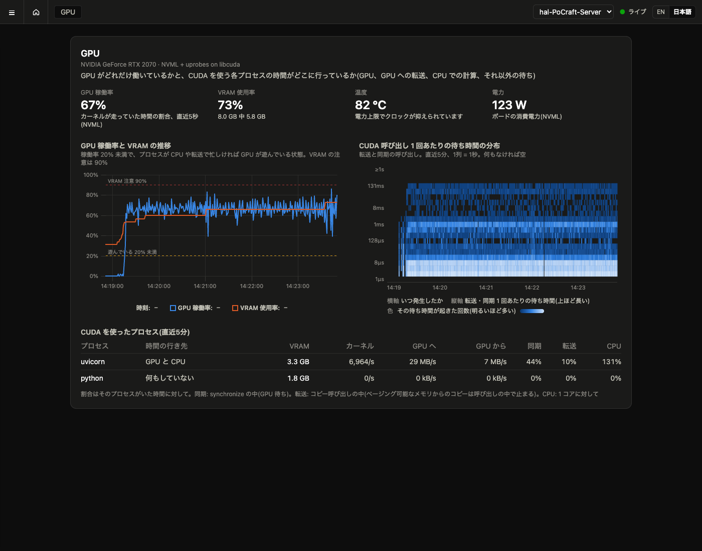

*何か。* GPU を両側から見ます。デバイス側は NVML から(稼働率、VRAM、温度、電力、クロック抑制。eBPFLens で唯一 eBPF でない源です。カーネルは GPU が何をしているか知らないので)、プロセス側は `libcuda` への uprobe から(カーネル起動、方向別の転送バイト数、転送呼び出しの中で止まった時間、同期呼び出しで GPU を待った時間、それに runqlat からの CPU 時間)。コンテナ内のプロセスも含みます。

*見えるもの。* タイル(GPU 稼働率、VRAM、温度と抑制の理由、電力)、稼働率と VRAM の推移(遊んでいる線と VRAM 注意の線付き)、転送・同期 1 回あたりの待ち時間のヒートマップ、時間の行き先の**判定**付きの CUDA プロセス表。

*読み方。* 判定から読みます。*GPU が上限*は良い状態。GPU がボトルネックで、プロセスはそれを待っています。*転送が上限*は、プロセスの時間が転送呼び出しの中で消えている状態。ページング可能なホストメモリからコピーしている(呼び出しごとに止まる)か、バッチが小さい。pinned メモリかバッチの拡大が効きます。*GPU と CPU*は、GPU が働くのは時間の一部で、残りはプロセスが CPU で計算している状態。前処理・トークナイズ・Python のオーバーヘッドが次の上限です。*CPU が上限*はその GPU がほぼ遊んでいる版。*別の待ち*は CPU でも CUDA 呼び出しの中でもない状態で、I/O、ロック、入力を待っています。*何もしていない*は、モデルを載せたまま要求がなく VRAM を持っているだけ。温度のタイルが「クロックが抑えられている」と言っていれば、「稼働しているのに遅い」GPU の説明になります。

### 履歴(`/history`)

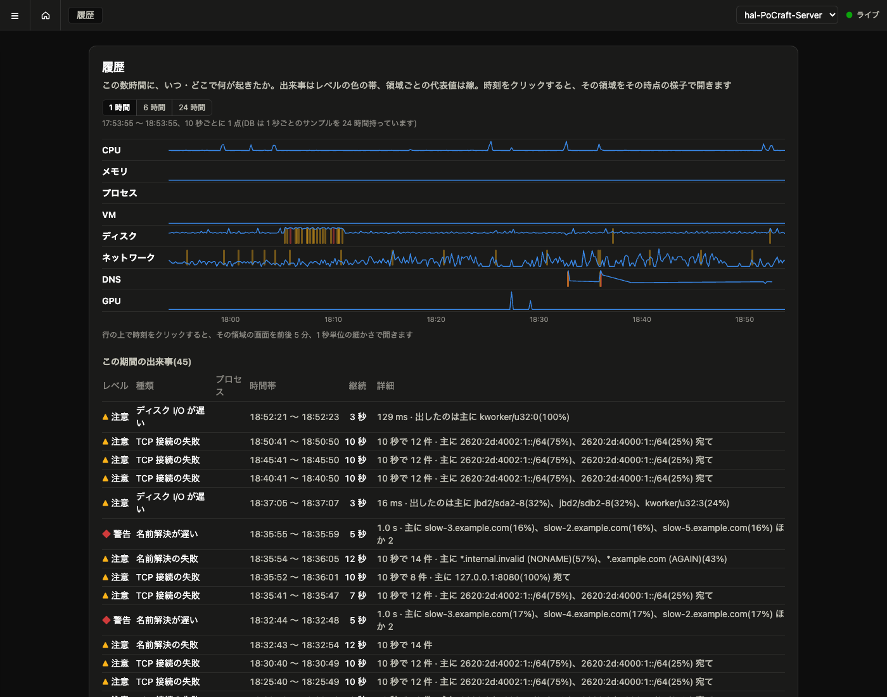

*何か。* サーバーの DB から見た直近 1 / 6 / 24 時間。領域ごとに 1 行で、その領域の出来事をレベルの色の帯に、代表値を線にします(CPU 待ち p99、回収停止、稼働中の VM、ディスク p99、再送/秒、DNS p99、GPU 稼働率)。サンプルはサーバー側で数百点に畳むので、ヒストグラムは点ごとに正しいパーセンタイルのままです。

*使い方。* **いつ**・**どこで**を見つけます(「3:05 にディスクと DNS の帯が同時に出ている」)。次に**その行のその時刻をクリック**すると、その領域の画面が前後 5 分(`/disk?at=…`)で開きます。DB から 1 秒単位の細かさで、上にその旨の帯と、ライブ・履歴に戻るリンクが出ます。下の出来事の一覧はこの期間に絞られます。

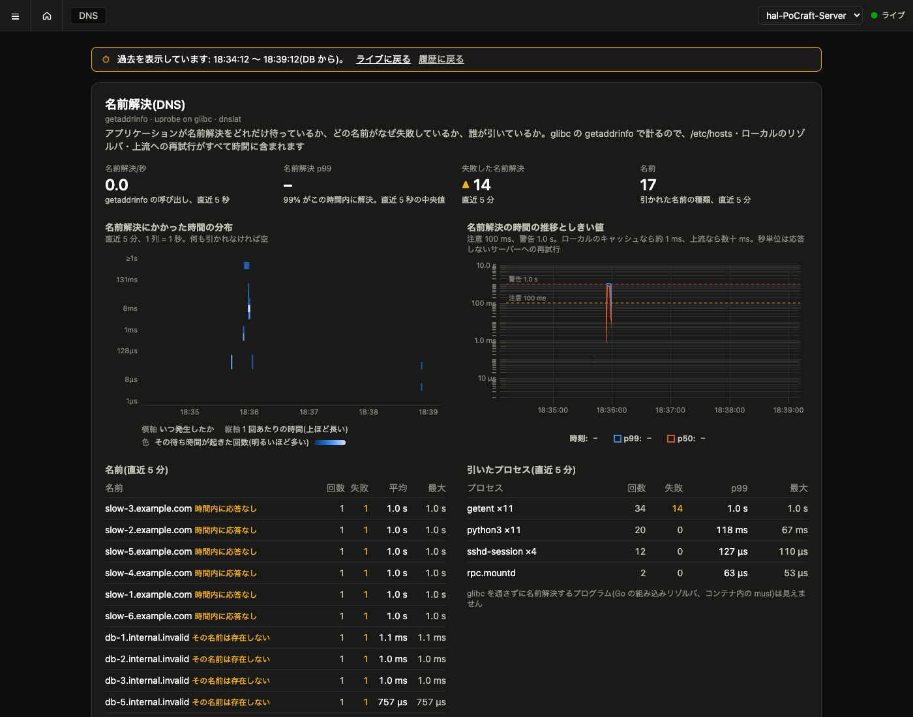

*限界。* DB が 1 秒ごとのサンプルを持つのは 24 時間(`-retention`)なので、いまはそこまでです。24 時間の表示は読み込みに数秒かかります。過去の画面のタイル(「直近 5 秒」「直近 5 分」)は表示している窓の終わりを指します。ダッシュボード、設定、履歴そのものは常にライブです。

### すべてのパネル(`/all`)

上の画面のパネルを 1 ページに縦に並べ、ジャンプリンク付き。クリックよりスクロールしたいときに。

## 5. 出来事: 種類ごとの意味と対応

出来事は**サーバー側**で固定のルールにより決まります(しきい値は JSON、8 章)。開いている間、レベルは下がりません。最大値が経過を語ります。サーバー再起動時に開いていた出来事は、最後の更新時刻で閉じた扱いになります。止まっていた間のことを知っているふりはしません。

| 種類 | 開く条件 | レベル | 閉じる条件 | 意味と対応 |
|---|---|---|---|---|
| **CPUの取り合い**(`cpu_wait`) | 実行待ち p99 ≥ 1 ms が 3 秒 | 注意。10 ms 以上が 3 秒続けば警告 | 1 ms 未満が 2 秒を超えて続く | タスクが CPU を待っています。CPU 画面の*原因*の表が占有者を、*影響*の表が被害者を名指しします。占有者を絞るか移す。誰が食べているか分かる前に CPU を足さない。 |
| **メモリ回収による停止**(`mem_stall`) | 停止 ≥ 10 ms/秒が 3 秒 | 注意。100 ms/秒以上で警告 | 10 ms/秒未満が 2 秒を超えて続く | カーネルが空きを作る間、プロセスが固まっています。メモリ画面が誰かと、cgroup の上限(上限を直す)かホスト(空ける・足す)かを言います。 |
| **メモリ不足で強制終了**(`oom_kill`) | カーネルがプロセスを殺した | 警告 | 即時 | 根拠: 被害者、引き金のプロセス、ホストか cgroup か。引き金が被害者と違えば、見るべきは引き金です。 |
| **クラッシュ**(`crash`) | クラッシュのシグナルかコアダンプ付きの終了 | 注意 | 即時 | ソフトウェアの不具合。そのプロセスのログとコアダンプを。 |
| **クラッシュの繰り返し**(`crash_loop`) | 同じコマンドが 5 分に 3 回クラッシュ | 警告 | 最後のクラッシュから 5 分 | 何かが同じ失敗に向けて再起動し続けています。まず再起動のループを止め、それからクラッシュを直す。 |
| **エージェント停止**(`agent_down`) | 30 秒サンプルが来ない | 警告 | ホストがまた報告する | ホストか、ネットワークか、エージェントが落ちています。このホストの他の値はすべて古い。まずホストを見る。 |
| **VM の CPU 待ち**(`vm_cpu_wait`) | VM のホスト側の待ち p99 ≥ 1 ms が 3 秒 | 注意。10 ms 以上が 3 秒続けば警告 | 1 ms 未満が 2 秒を超えて続く | VM が隣人に時間を奪われています。出来事が誰が CPU を取ったかを名指しします(グループ。下記)。VM のページに次にすることがあります。 |
| **VM 停止**(`vm_down`) | VM の QEMU プロセスが終了 | OOM・クラッシュは警告、killed・正常終了は注意 | 即時 | VM のページを開く。原因・根拠・次にすることがそこにあります。 |
| **GPU が遊んでいる(プロセスは別の場所で忙しい)**(`gpu_starved`) | GPU の稼働率 20% 未満のまま、CUDA プロセスが CPU か転送呼び出しで 50% 以上忙しい状態が 10 秒 | 注意。90% 以上で警告 | GPU が働き出すか、プロセスが静かになって 5 秒を超える | GPU がプロセスを待っていて、逆ではありません。出来事がどちらかを言います: CPU(前処理、トークナイズ、Python)か転送(ページング可能メモリ、小さいバッチ)か。直すのはその側で、大きな GPU にしても効きません。 |
| **ディスク I/O が遅い**(`disk_slow`) | ブロック I/O の待ち時間 p99 ≥ 10 ms が 3 秒 | 注意。100 ms 以上が 3 秒続けば警告 | 10 ms 未満が 2 秒を超えて続く | ディスクが本来より遅いか、キューが溜まっています。出来事がバイトの大半を出したプロセスを名指しします(CPU と同じグループのルール)。誰も目立たずトラフィックも少なければデバイスを疑う。 |
| **ディスク I/O エラー**(`disk_error`) | ブロックデバイスが I/O をエラーで完了した | 警告 | 即時 | そのデバイスの `dmesg` と SMART をすぐ確認。エラーはディスクの故障やケーブル不良の最初の兆候です。 |
| **TCP 接続の失敗**(`net_connect_fail`) | 直近 10 秒に失敗した接続が 5 回以上、しかもそのうち 3 秒以上に散らばっている(1 秒の一斉失敗、たとえば届かない IPv6 アドレスを十数個試してから IPv4 に落ちる接続性チェックは、障害ではない) | 注意。50 回以上で警告 | 10 秒間に 5 回未満が 10 秒を超えて続く | 失敗の大半を占めた宛先を名指しします。拒否なら何も待ち受けていない(サービスが落ちているかポートが違う)、到達不能やタイムアウトなら経路かファイアウォール。 |
| **TCP 接続が遅い**(`net_connect_slow`) | 接続 p99 ≥ 200 ms が 3 秒 | 注意。1 秒以上で警告 | 200 ms 未満が 5 秒を超えて続く | 1 秒なら SYN 自体が再送されています。その宛先へのパケットが落ちている。それ未満なら遅い経路か過負荷の相手。 |
| **カーネルがパケットを破棄**(`net_drop`) | 直近 10 秒に問題の理由で捨てられたパケットが 10 個以上、そのうち 3 秒以上に散らばっている | 注意。100 個以上で警告 | 10 秒間に 10 個未満が 10 秒を超えて続く | 大半を占めた理由と宛先を名指しします(`TCP_LISTEN_OVERFLOW 192.168.10.250:8099 (python3)`)。どの流れも目立たなければ理由だけ。理由が直し方を示します: LISTEN_OVERFLOW は待ち受けているプロセスが受け取り切れていない(ワーカーを増やす、バックログを上げる)。NETFILTER_DROP はファイアウォールのルール(`nft list ruleset`)。*NOROUTES / NEIGH_* は経路(`ip route`、ゲートウェイ)。QDISC_* / CPU_BACKLOG はインターフェースか CPU の飽和。*MEM はメモリ。日常の破棄は数えません。 |
| **TCP の再送**(`net_retrans`) | 再送 10 セグメント/秒以上が 3 秒 | 注意。100/秒以上で警告 | 10/秒未満が 5 秒を超えて続く | 名指しされた宛先へのパケットロスか輻輳。「addr のクライアント」なら、このホストに入ってくる接続でのロス。リンク、スイッチのポート、相手を確認。 |
| **名前解決の失敗**(`dns_fail`) | 直近 10 秒に失敗した `getaddrinfo` が 5 回以上、そのうち 3 秒以上に散らばっている | 注意。50 回以上で警告 | 10 秒間に 5 回未満が 10 秒を超えて続く | 名前とエラーを名指しします。特定の名前が目立たなければ親ドメイン(`*.internal.example (NONAME)`)。*その名前は存在しない*: 名前かレコードを直す。*時間内に応答なし*: DNS サーバー。 |
| **ファイルを開けない**(`file_fail`) | 問題の errno(EACCES、EPERM、EROFS、ENOSPC、EDQUOT、EMFILE、ENFILE、EIO、ETXTBSY、ESTALE。/proc・/sys・/dev の下は除く)で失敗した open が直近 10 秒に 5 件以上、そのうち 3 秒以上に散らばっている | 注意。50 件以上で警告 | 10 秒間に 5 件未満が 10 秒を超えて続く | `プロセス パス (ERRNO)` を名指しします。1 つのプロセスが多数のファイルで失敗していれば `プロセス (ERRNO)`。ENOENT は数えません(ファイル画面に出ます)。errno が直し方を示します: 権限なら所有者・モード・サービスのユーザー。EROFS なら `dmesg`、マウントが読み取り専用になった。ENOSPC なら空きを作る。EMFILE ならディスクリプタの漏れ。 |
| **fsync が遅い**(`fsync_slow`) | fsync p99 ≥ 100 ms が 3 秒 | 注意。1 秒以上で警告 | 100 ms 未満が 5 秒を超えて続く | fsync の時間の大半を占めたファイルを名指しします。同じ時刻のディスク画面を見てください: 遅いデバイスか、キュー待ちか(データベースのコミットの前にバックアップの writeback)。 |
| **ロック待ち**(`lock_wait`) | プロセスのロック待ち(ユーザー + カーネル、スレッド全体の合計)が毎秒 1.0 秒以上を 3 秒 | 注意。4.0 以上で警告 | 1.0 未満が 2 秒を超えて続く | プロセスを名指しし、待ちを自分のロックとカーネルのロックに分けます。CPU を足さないこと: 仕事はロックで直列化しています。ロックを特定し(`perf lock contention`、py-spy、async-profiler、Go の mutex profile)、握っている間の処理を短くする、分割する、スレッドを減らす。 |
| **メモリがディスクから戻る待ち**(`fault_stall`) | major page fault で止まった時間がホスト全体で毎秒 100 ms 以上を 3 秒 | 注意。毎秒 1 秒以上で警告 | 100 ms/秒未満が 2 秒を超えて続く | プロセスと、スワップから来たフォールトの割合を名指しします。スワップからなら、ホストのメモリが尽きた。空けるか足す(誰が持っているかは回収の表)。ページキャッシュからなら、ワーキングセットが収まらなくなったか、起動直後にバイナリを読み直している。 |
| **1 つの CPU が割り込みで手一杯**(`irq_busy`) | 1 つの CPU の時間のうち割り込みが 30% 以上を 3 秒 | 注意。60% 以上で警告 | 30% 未満が 2 秒を超えて続く | CPU と、時間を取った種類・線を名指しします。割り込みを散らす: NIC の RSS / 複数キュー、RPS(`/sys/class/net/<dev>/queues/rx-*/rps_cpus`)、irqbalance。速い CPU は 1 コアには効きません。 |
| **名前解決が遅い**(`dns_slow`) | 名前解決 p99 ≥ 100 ms が 3 秒 | 注意。1 秒以上で警告 | 100 ms 未満が 5 秒を超えて続く | `resolvectl status` と上流サーバーを確認。秒単位は応答しないサーバーへの再試行。 |
| **VRAM がほぼ満杯**(`vram_full`) | VRAM の 90% 以上を使っている状態が 3 秒 | 注意。97% 以上で警告 | 90% 未満が 2 秒を超えて続く | 次の大きな確保が失敗してジョブが死にます。GPU の画面がどのプロセスが VRAM を持っているかを言います。 |

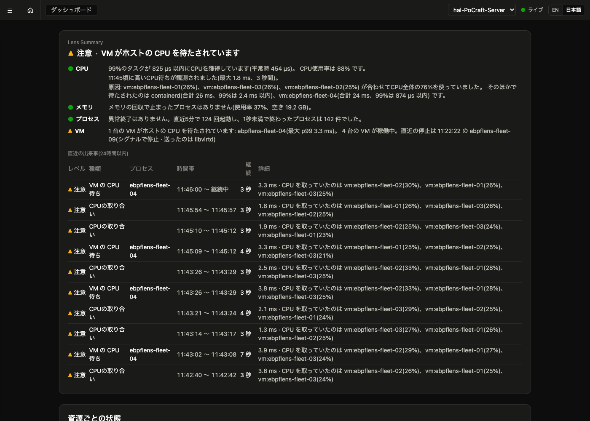

**誰が CPU を取ったか。** `cpu_wait` と `vm_cpu_wait` の出来事には*原因のグループ*が付きます。ホストの 10% 以上を使ったプロセスや VM を大きい順に最大 5 件、合計が 50% 以上のときだけ(待っている VM 自身は原因になりません)。占有者 1 本なら 1 件、約 25% ずつの隣人 3 台なら 3 件、多数で均等に分け合っているなら「特定のプロセスや少数のグループではない」と言い、推測の代わりにホストの busy 率を添えます。

`vm_down` の原因:

| 原因 | 根拠 | 次にすること(と理由) |
|---|---|---|
| `cgroup_oom` | VM 自身の cgroup の中での OOM kill と、引き金のプロセス | VM のメモリ上限を上げるかゲストのメモリを減らす。上限がそのままなので再起動だけでは繰り返す。 |
| `host_oom` | ホスト全体の OOM kill | ホストの割り当て過多。ホストのメモリを空けてから再起動しないと、また起きうる。 |
| `crash` | QEMU がクラッシュのシグナルかコアダンプで終了 | 再起動する。QEMU のクラッシュはゲストのせいではない。QEMU のログとコアダンプを確認。 |
| `killed` | QEMU に終了シグナルが送られた。誰が送ったか付き | 意図した操作でなければ再起動。送り主が *libvirtd* の場合、ゲストの shutdown と `virsh destroy` の両方がこれになる(7 章)。 |
| `shutdown` | シグナルなしの exit 0 | 正常終了。意図していなければ再起動。 |

## 6. 通知

`ebpflens-server -webhook URL` で、**遷移**(開始・格上げ・終了)ごとに 1 行を POST します。途中経過は送りません。`-webhook-format generic` は `{event, text, incident}`、`slack` は `{text}`、`discord` は `{content}`。文面は英語で、例:

```
[WARNING] hal: processes are competing for CPU (99% of tasks waited up to 16.3 ms, 3 s since 09:01:34)
[RESOLVED] hal: processes are competing for CPU (99% of tasks waited up to 16.3 ms, 21 s since 09:01:34)
[WARNING] hal: flaky-app is crashing repeatedly (3 times since 09:02:00)
[WARNING] hal: host stopped reporting (last sample at 09:02:09, silent for 30 s)
[WARNING] hal: VM web-02 stopped at 09:55:38: its cgroup memory limit was reached; triggered by libvirtd (pid 2002). In the minute before: 1188 ms stalled in memory reclaim, CPU wait p99 29 µs
```

送信は非同期で 1 回だけ再試行。webhook が死んでいてもエージェントは止まりません。

## 7. 見えないもの、限界

- **認証がありません。** サーバーに届く人は誰でも全部を読め、偽のサンプルを送れます。信頼できるネットワークの中だけで動かしてください。
- **ゲストの shutdown と `virsh destroy` はホストから同じに見えます。** libvirt は QEMU を `-no-shutdown` で動かし、どちらの場合も自分で SIGTERM を送り、QEMU は SIGTERM で exit 0 します。見分けるには libvirt 自身の停止理由が必要で、まだ読んでいません。
- **原因のグループは、10% 以上のメンバーの合計が 50% 以上のときだけ。** 多数の小さなプロセスが均等に分け合っていると原因は出ず、代わりにホストの busy 率を報告します。
- **プロセス別の表は上位 N 件です。** エージェントは毎秒、待ち時間と CPU の上位 8 件(VM は常に)を送ります。長い範囲の合計は近似で、画面にもそう書いてあります。
- **ホスト全体の OOM による VM の停止**は、記録したイベントの形に対する単体テストでしか再現していません。
- **しきい値は仮です。** 8 コア 1 台の実測から決めました。自分のホストに合わせて調整してください(8 章)。
- **バッファされた書き込みはカーネルの writeback スレッド**(`kworker`、`jbd2`)に帰属し、書いたプロセスには帰属しません。読み込みと direct 書き込みはプロセスに帰属します。ディスクの待ち時間にはキュー待ちが含まれるので、飽和したディスクは健全でも遅く見えます。
- **再送は宛先ごとにだけ数えます**(プロセスは分からない。カーネルがプロセスの文脈なしに再送する)。入ってくる接続はクライアントのアドレスごとに 1 行にまとめます。接続と再送は TCP だけですが、捨てられたパケットはすべてのプロトコルが対象です。
- **捨てられたパケットの待ち受けプロセスが分かるのは、エージェントの稼働中に LISTEN に入った TCP ポートだけです。** エージェントが起動した時点で既に待ち受けていたサービスは、次に listen し直すまで待ち受けが空欄になります(エージェントは起動時にほとんどのサービスより先に立ち上がるので、主にエージェントを再起動したあとの話です)。理由の段分けは固定の表で、表にない理由は日常として扱います。
- **失敗した open が見えるのは `open` / `openat` / `openat2` だけです。** 開く前に `stat()` で確かめるプログラム(Rust 版 coreutils の `cat`、多くのシェル)はそこで失敗するので、ここには出ません。パスはプログラムが渡したまま(相対パスは相対のまま、先頭 95 バイトまで)。fsync は `do_fsync`(システムコール)で計り、io_uring と NFS サーバーの同期は見えません。
- **ロック待ちと寝かせは、futex アドレスごとの待ち手の数で見分けます。** 常に 1 本しか待たないロック(2 本のスレッドが行儀よく交互に渡し合う)は寝かせに見えて数えません。多数が待つ条件変数は別の futex 操作を使うので、意図して除いています。カーネルのロック競合には `lock:contention_*` tracepoint(5.19 以降)が要り、無くてもユーザー空間側は動きます。
- **ページフォールトは `handle_mm_fault` で計ります。** カーネル自身の `get_user_pages` もここを通り、引き起こしたタスクに付きます。スワップの出入りと大きさは eBPF ではなく `/proc` から。
- **ハード割り込みの時間は線ごと・CPU ごと**に per-CPU 配列で持ちます(IRQ 番号 511 までは個別、それ以上は 1 つにまとめる)。名前は `/proc/interrupts` から。スレッド化された IRQ ハンドラはカーネルスレッドで、ここでは数えません。割り込みプローブと、ロックプローブのスピンロックの半分は、意図してハッシュも LRU も使いません。割り込み文脈で走る BPF はロックを取ってはいけない(そこで競合したマップの bucket ロックがロック競合の tracepoint を鳴らし、その連鎖が NVIDIA の割り込みの隣で検証機を hard lockup させました)。
- **スピンロックの競合は種類ごとにだけ**数え、プロセスには付けません。割り込み文脈で起きうるので、その時の current は割り込まれた誰かです。mutex と rwsem の待ちはプロセスに付きます。
- **DNS は glibc の `getaddrinfo` で計ります**。glibc を通さずに名前解決するプログラム(Go の組み込みリゾルバ、コンテナ内の musl)は見えず、名前は先頭 63 バイトまで。
- **見る GPU は 1 枚目だけ**で、GeForce では NVML のプロセス別稼働率が取れません(Not Found)。判定はプロセスが何をしていたか(CPU、転送、同期)とデバイスの稼働率から組み立てます。uprobe にはカーネル 6.6 以上(multi-uprobe の BPF リンク)が要り、古いカーネルでは GPU の画面はデバイス側だけになります。
- **Linux 専用です。** macOS には eBPF がなく、できる範囲の macOS エージェントは計画のみ。
- **Windows は需要がなければ作りません。**
- **ダッシュボードはサンプル 5 分・出来事 24 時間を表示します。** DB はサンプル 24 時間・イベント 7 日・出来事 30 日を保持しますが、長期の履歴画面はまだありません。

## 8. 設定と API の早見表

### 設定画面(`/settings`)

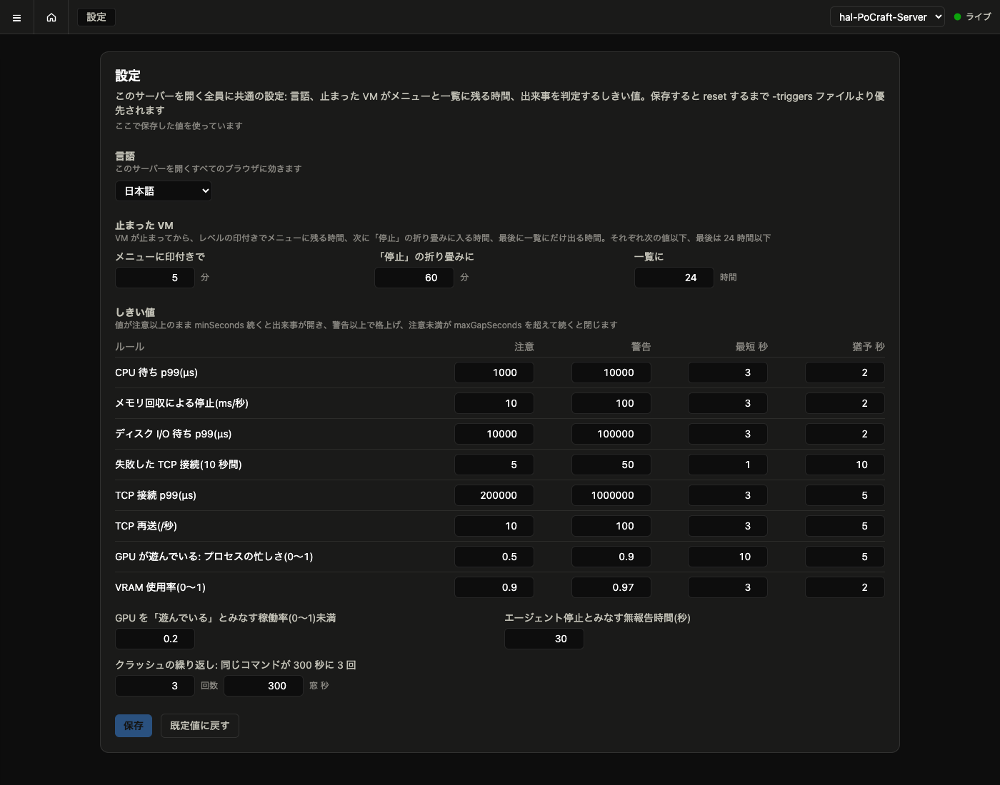

下の内容はメニューの**設定**画面からも、すべてのブラウザに対して一度に変えられます。**言語**(ブラウザに従う / EN / 日本語。ヘッダーの切り替えは無くなり、ここだけ)、**止まった VM** がメニューに印付きで残る時間・「停止」の折り畳みに入る時間・一覧に出る時間、出来事を判定するすべての**しきい値**。*保存*でサーバーの DB に書かれ、すぐ効きます。グラフの帯は描き直され、開いている出来事も次のサンプルから新しい値で判定されます。*既定値に戻す*は保存した値を消します。優先順位: 組み込みの既定値 ← 起動時の `-triggers` ファイル ← 画面で保存した値。`-db` が無ければ、保存はサーバー再起動まで。

サーバー:

| フラグ | 既定 | 意味 |
|---|---|---|
| `-addr` | `:8080` | 待ち受けアドレス |
| `-db` | (なし) | SQLite ファイル。空なら保存しない |
| `-keep` | 900 | ホスト×プローブごとにメモリに持つサンプル数(画面の窓) |
| `-keep-events` | 20000 | ホストごとにメモリに持つイベント数 |
| `-retention` / `-event-retention` / `-incident-retention` | 24h / 168h / 720h | DB の保持期間 |
| `-triggers` | (既定値) | 既定のしきい値の上に重ねる JSON。`-print-triggers` で既定値を出力 |
| `-webhook` / `-webhook-format` | (なし) / `generic` | 通知 |

エージェント: `-server URL`、`-host 名前`、`-interval 1s`、`-top 8`、`-text`(人が読む出力)、`-count N`。

しきい値のファイル(値は既定値):

```json
{
  "cpu":       {"caution": 1000, "warning": 10000, "minSeconds": 3, "maxGapSeconds": 2},
  "memory":    {"caution": 10,   "warning": 100,   "minSeconds": 3, "maxGapSeconds": 2},
  "processes": {"crashLoopCount": 3, "crashLoopWindowSeconds": 300},
  "agentDown": {"afterSeconds": 30},
  "gpu":       {"idleUtil": 0.2,
                "starved": {"caution": 0.5,  "warning": 0.9,  "minSeconds": 10, "maxGapSeconds": 5},
                "vram":    {"caution": 0.9,  "warning": 0.97, "minSeconds": 3,  "maxGapSeconds": 2}},
  "disk":      {"caution": 10000, "warning": 100000, "minSeconds": 3, "maxGapSeconds": 2},
  "network":   {"connectFails":   {"caution": 5,      "warning": 50,      "minSeconds": 1, "maxGapSeconds": 10}, "failSpreadSeconds": 3,
                "connectLatency": {"caution": 200000, "warning": 1000000, "minSeconds": 3, "maxGapSeconds": 5},
                "retrans":        {"caution": 10,     "warning": 100,     "minSeconds": 3, "maxGapSeconds": 5},
                "drops":          {"caution": 10,     "warning": 100,     "minSeconds": 1, "maxGapSeconds": 10}},
  "dns":       {"fails":   {"caution": 5,      "warning": 50,      "minSeconds": 1, "maxGapSeconds": 10}, "failSpreadSeconds": 3,
                "latency": {"caution": 100000, "warning": 1000000, "minSeconds": 3, "maxGapSeconds": 5}},
  "files":     {"fails":        {"caution": 5,      "warning": 50,      "minSeconds": 1, "maxGapSeconds": 10}, "failSpreadSeconds": 3,
                "fsyncLatency": {"caution": 100000, "warning": 1000000, "minSeconds": 3, "maxGapSeconds": 5}},
  "locks":     {"caution": 1.0, "warning": 4.0, "minSeconds": 3, "maxGapSeconds": 2},
  "faults":    {"caution": 100, "warning": 1000, "minSeconds": 3, "maxGapSeconds": 2},
  "irq":       {"caution": 0.3, "warning": 0.6, "minSeconds": 3, "maxGapSeconds": 2}
}
```

API(断りがなければ `GET`): `/api/history?host=&probe=&from=&to=&bucket=`(from/to は Unix ms、bucket は秒。1 = 生のサンプル、最長 30 分)、`/api/history/events?host=&from=&to=`、`/api/settings`(`PUT` で置き換え。`{"ui":{"lang":"ja"}}` のような部分的な文書は今の設定に重ねる。`DELETE` で既定に戻す)、`/api/hosts`、`/api/samples?host=&probe=runqlat|memstall|vms|gpu|biolat|tcpconn|dnslat`、`/api/events?host=`、`/api/incidents?host=`(新しい順。継続中は `end` なし)、`/api/triggers`、`/api/stream?host=`(SSE: `sample`、`events`、`incident`)。エージェントは `POST /api/ingest` と `/api/events`。

## 9. 用語集

- **実行待ち時間(run-queue latency、CPU 待ち)** — タスクが実行可能になってから実際に CPU で動くまでの時間。CPU の飽和の信号。
- **p50 / p99** — 測定値の半分 / 99% がその下に収まる値。p99 は運の悪いリクエストが見る値。
- **回収停止(reclaim stall)** — カーネルが代わりにメモリを空ける間、プロセスが止められること(direct reclaim / cgroup reclaim)。
- **PSI** — カーネルの Pressure Stall Information(`/proc/pressure/*`)。機械全体で失った生産時間。1 プロセスだけが止まるとプロセス別の値より小さく出る。
- **OOM kill** — メモリ不足でカーネルがプロセスを殺すこと。ホスト全体でも cgroup の中でも起きる。
- **cgroup** — カーネルの資源制限の単位。コンテナも VM もそれぞれ 1 つの中にいる。
- **steal** — VM が使いたかったのにホストが他に渡した CPU 時間。eBPFLens では VM のホスト側の実行待ちとして見える。
- **出来事(incident)** — ルールが「おかしい」と判定した 1 件。根拠・開始・終了・レベルを持つ。
