# eBPFLens operator's manual

[日本語版](manual.ja.md)

This is for the person on call: capable, busy, not a kernel expert. It says what eBPFLens can see, what each screen means, and what to do when it turns yellow or red. Design background is in [ADR 0001](adr/0001-everyone-an-sre.md); build and deployment are in the [README](../README.md).

## 1. eBPFLens in five minutes

eBPFLens watches Linux hosts from inside the kernel with eBPF and turns what it sees into plain statements: *whether* something is wrong, *what*, *who caused it*, *who is affected*, and *what to do*. It does not poll averages; it counts every scheduler switch, every memory-reclaim stall, every process start and exit, every OOM kill, and every terminating signal, so it also catches what happens between two polls.

Open the dashboard (`http://<server>:8080`). Read it top to bottom:

1. **Lens Summary** — one line with a level and a headline (e.g. *Warning · Processes are competing for CPU*), then one line per area: **CPU**, **Memory**, **Processes**, **VM**.
2. **Recent incidents** — everything that opened in the last 24 hours, newest first.
3. **Status by resource** — a grid of resources × *Utilization / Saturation / Errors*. Every cell links to a detail screen.

If the headline is green, nothing needs you. If it is not, the headline names the area; the finding line under it says what happened and, where known, why; click through the cell or the menu for the evidence.

Language: **EN / 日本語** in the top bar. Host: the selector in the top bar (one server can watch several hosts).

## 2. Installing and deploying

### What you need

- **Monitored hosts**: Linux with kernel BTF (`/sys/kernel/btf/vmlinux` exists — Ubuntu, Fedora, RHEL 9, Debian 12 and later ship it). Tested on Ubuntu 26.04 / kernel 7.0. The agent is one binary linked against glibc 2.34 or later (Ubuntu 22.04, Debian 12, RHEL 9 and newer); nothing else is installed on the host. Kernel **6.6 or later** is needed for two optional probes that use multi-uprobe links — the GPU's per-process detail and DNS; on an older kernel the agent runs without them. The GPU screen also needs an NVIDIA driver; without one there is simply no GPU row.
- **A build machine** (same architecture; the same or an older distribution than the hosts, because the binaries link against the build machine's glibc): Go 1.25+, clang, llvm, libbpf-dev, bpftool, and **gcc** (cgo, for the official NVML binding the GPU probe uses; the Makefile silences the deprecation warnings from NVIDIA's header). The UI is built once with Node 22 and embedded into the server binary, so browsers need nothing.
- **A server**: any Linux box the hosts can reach on one TCP port (default 8080). It can be one of the monitored hosts. SQLite is built in; no database service.
- **Network**: agents → server `:8080` (HTTP), browsers → server `:8080`. There is no authentication (§7): keep this port inside a trusted network or behind a reverse proxy that adds it.

### Build

```bash
git clone https://github.com/y6ui3i/ebpf-lens && cd ebpf-lens
make web      # on a machine with Node: generates TS types, builds the UI into internal/webui/dist
make build    # on Linux: vmlinux.h from this kernel's BTF, BPF objects, then bin/ebpflens-agent and bin/ebpflens-server
```

`bin/` now holds two binaries. Copy `ebpflens-agent` to every host you want to watch; the server goes wherever you decided.

### Deploy the server (systemd)

On the server machine, from the repository:

```bash
sudo useradd --system --no-create-home --shell /usr/sbin/nologin ebpflens
sudo usermod -aG ebpflens "$USER"            # optional: lets you read the DB with sqlite3
make install                                 # /opt/ebpflens/bin/*, /etc/systemd/system/ebpflens-{server,agent}.service
sudo systemctl enable --now ebpflens-server
```

The unit runs the server as `ebpflens` with no privileges, listening on `:8080`, DB at `/var/lib/ebpflens/ebpflens.db` (24 h of samples, 7 days of events, 30 days of incidents). To put the DB on another disk, add a drop-in — never on NFS:

```ini
# /etc/systemd/system/ebpflens-server.service.d/10-local-db.conf
[Unit]
RequiresMountsFor=/data/ebpflens
[Service]
ExecStart=
ExecStart=/opt/ebpflens/bin/ebpflens-server -addr :8080 -db /data/ebpflens/ebpflens.db
ReadWritePaths=/data/ebpflens
```

To change thresholds or add notifications, put the extra flags on the same `ExecStart` line (`-triggers /etc/ebpflens/triggers.json`, `-webhook https://… -webhook-format slack`; see §8), then `sudo systemctl daemon-reload && sudo systemctl restart ebpflens-server`.

### Deploy an agent on each host (systemd)

On every monitored host:

```bash
sudo useradd --system --no-create-home --shell /usr/sbin/nologin ebpflens
sudo install -d /opt/ebpflens/bin
sudo install -m 0755 ebpflens-agent /opt/ebpflens/bin/
sudo install -m 0644 deploy/systemd/ebpflens-agent.service /etc/systemd/system/
sudo systemctl daemon-reload
```

Edit the unit's `ExecStart` so `-server` points at your server (`-server http://SERVER:8080`; the shipped unit assumes the server is local), then `sudo systemctl enable --now ebpflens-agent`. The agent runs as `ebpflens` with only `CAP_BPF` and `CAP_PERFMON` — not root. The host appears in the dashboard's host selector under its hostname (`-host NAME` overrides). One server can watch many hosts; each host's agent is independent, and a host that stops reporting becomes an *Agent stopped reporting* incident after 30 s.

### Check that it works

```bash
systemctl status ebpflens-server ebpflens-agent
journalctl -u ebpflens-agent -n 20            # no "load bpf objects" errors
curl -s http://SERVER:8080/api/hosts          # every host with its last sample time
```

Open `http://SERVER:8080` — within a few seconds the Lens Summary should read green, with the CPU line giving a wait time in microseconds. If a host is missing: the agent is not running, cannot reach the server, or the kernel has no BTF (the agent log will say which).

### Update

Build the new binaries, then on the server `make install && sudo systemctl restart ebpflens-server`, and on each host copy the new agent to `/opt/ebpflens/bin/` and `sudo systemctl restart ebpflens-agent`. Incidents and history survive a server restart (§5 explains how open incidents are treated).

### Remove

`sudo systemctl disable --now ebpflens-agent` (and `ebpflens-server`), delete `/opt/ebpflens`, the units, `/var/lib/ebpflens` (the DB), and the `ebpflens` user. The agent leaves nothing else on a host; eBPF programs are detached when it stops.

## 3. Reading the dashboard

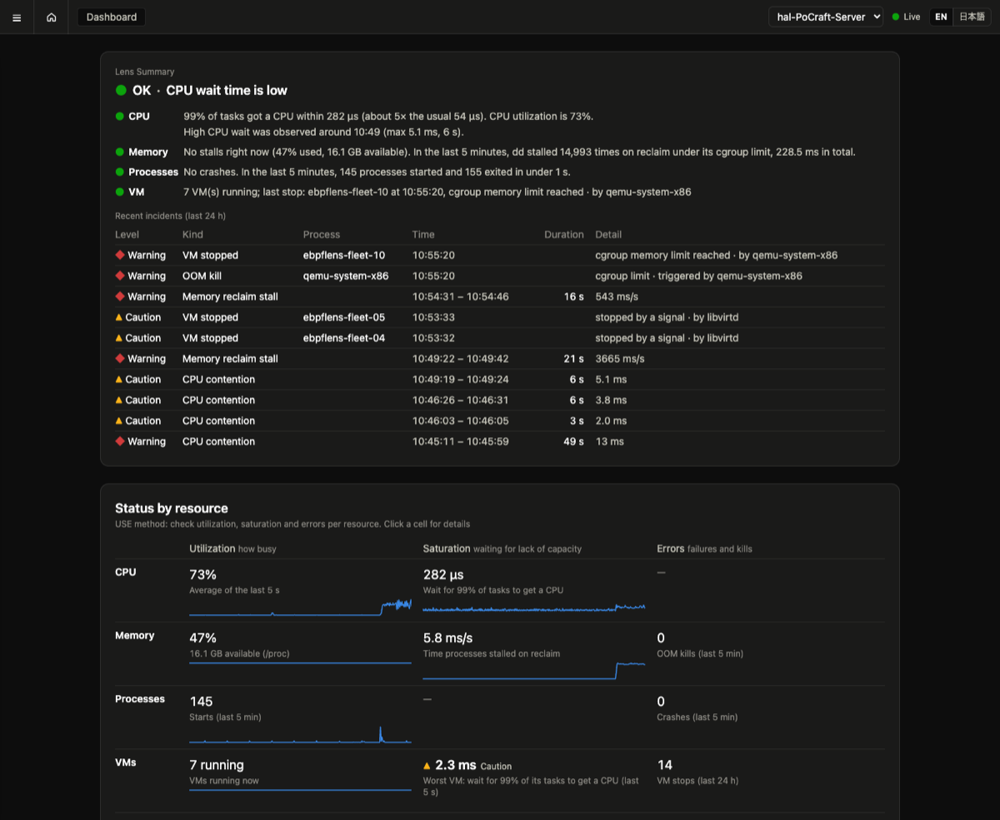


### Levels

| Mark | Level | Meaning |
|---|---|---|
| ● | OK | within the normal range |
| ▲ | Caution | worth a look; the threshold was crossed for a few seconds, or something abnormal but survivable happened |
| ◆ | Warning | act: a hard threshold was crossed for a while, a process was killed or is crash-looping, a host or VM stopped |

The overall level is the **worst area**. For the headline, ties go in this order: a host that stopped reporting, then VM, then CPU, memory, processes, GPU — because when the agent is silent nothing else is fresh, and a VM death matters more than a process crash.

### The finding lines

- **CPU** — "99 % of tasks got a CPU within 30 µs (usually 29 µs). CPU utilization is 1 %." The first number is the run-queue latency p99 over the last 5 s: how long a task that was *ready to run* waited for a CPU. "Usually" is the median of the calm seconds in view. If there was a recent contention episode, a second sentence gives when, how long and the peak, and a third one names the cause ("stress-ng-cpu (32 processes) was using 93 % of total CPU") and the victims ("Other processes kept waiting: steam (437 ms total, 99 % within 989 µs)").
- **Memory** — whether any process is stalled right now in memory reclaim (a process that has to free memory itself before it can allocate), plus usage and free memory from `/proc`. If something stalled in the last 5 minutes, it says who and how much.
- **Processes** — the most recent OOM kill, crash loop or crash; otherwise the number of starts and how many processes lived under one second.
- **VM** — the most recent VM stop with its cause, or how many VMs are running.
- **Disk** — how long 99 % of block I/Os take to complete, the throughput, and who issues most of the I/O; failed I/Os in the last 5 minutes if any.
- **Network** — connects per second and how long 99 % of them take to establish; failed connects and retransmissions in the last 5 minutes, with the destination that took most of them.
- **GPU** (only on hosts with an NVIDIA GPU) — how busy the GPU is and how much VRAM is in use, then what the busiest CUDA process is doing with its time: keeping the GPU busy, copying, computing on the CPU, waiting for something else, or holding a loaded model idle. If the clocks are being held back (power cap, temperature), it says so.

### The report to send


**Report to send** (top right of the Lens Summary, and of each VM page) builds, for this moment, a plain-text message you can paste into chat, a ticket or an email: the **situation** (the headline and what is happening now), the **next step** with its reason, **whose problem it probably is** (application, infrastructure, hardware, network, a human action — or *unknown* when the rules cannot tell), the **evidence** (the finding lines), and the recent incidents with dates. It is built by the same fixed rules as the screen, never by guesswork (ADR 0001). *Copy* works on plain HTTP too: the browser's clipboard API needs HTTPS, so on a LAN the text is selected and copied the old way.

### Recent incidents

One row per incident: level, kind, process/VM, time span (or *ongoing*), duration, and a detail that depends on the kind (peak wait, ms/s stalled, signal, OOM scope and trigger, crash count, who sent the signal). Ongoing incidents have no end time. Section 5 lists every kind.

### Status by resource (USE)

Three questions per resource, after Brendan Gregg's USE method:

| Column | Question | Example cells |
|---|---|---|
| **Utilization** | how busy is it | CPU %, memory %, process starts, VMs running, disk throughput, connects/s, GPU busy |
| **Saturation** | is anything waiting for lack of it | CPU wait p99, ms/s stalled in reclaim, worst VM wait, disk latency p99, connect p99, VRAM in use |
| **Errors** | did anything fail or get killed | OOM kills, crashes, VM stops, disk I/O errors, failed connects and retransmits, GPU clocks held back |

Cells show the latest value, a 5-minute sparkline, and a level mark only when something is wrong. "Not implemented (roadmap n)" marks what is not built yet.

## 4. The screens

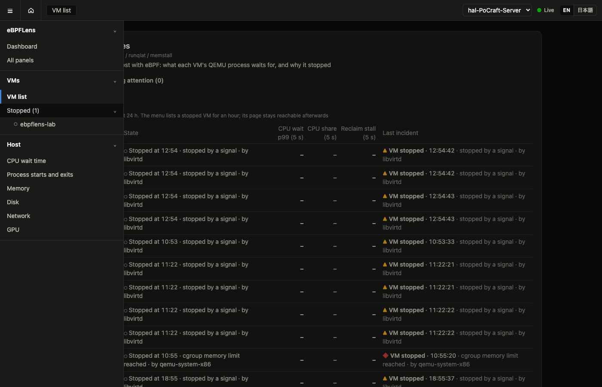


The menu (☰) has three groups: **eBPFLens** (Dashboard, All panels), **VMs** (VM list, then one entry per VM), **Host** (CPU wait, processes, memory; disk, network and GPU are planned).

### CPU wait (`/cpu`)

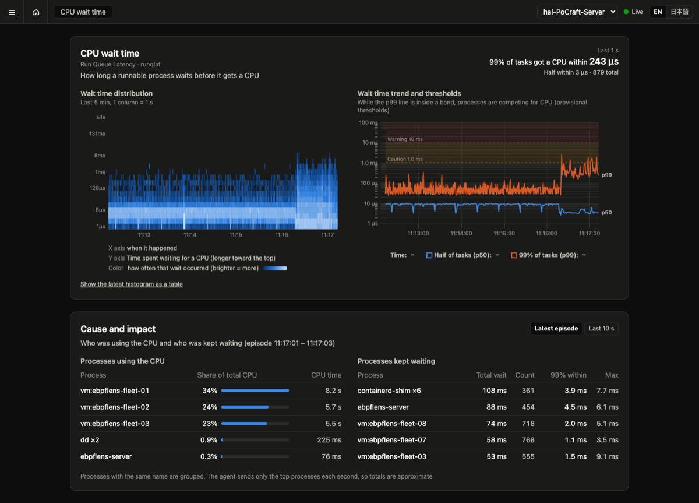


*What it is.* How long a runnable task waited for a CPU. On a calm 8-core box the 99th percentile is tens of microseconds; under 4× oversubscription it is 8–16 ms. Waiting here is invisible to CPU-utilization graphs: a host at 70 % can still make tasks wait milliseconds if the wrong ones are runnable at once.

*What you see.*
- **Wait time distribution** — a heatmap: x is time (last 5 min, one column per second), y is the wait (log scale, longer toward the top), colour is how often. Contention shows as the bright band jumping from the 8 µs row to the 8 ms row.
- **Wait time trend** — p50 and p99 with the caution (1 ms) and warning (10 ms) bands. While p99 is inside a band, processes are competing for CPU.
- **Cause and impact** — two tables for the latest episode (or the last 10 s): who *used* the CPU (share of the whole host) and who *waited* (total wait, count, p99, max). A "cause" is a process using ≥ 30 % of the host by itself; several neighbours at 25 % each are reported as victims only (a known gap, see §7).

*Reading it.* The process that waits most is the one users feel. A big consumer with a small wait is a hog; a small consumer with a big wait is a victim. Under EEVDF, tasks that sleep often (interactive ones) get preference when they wake, so victims usually wait an order of magnitude less than the hog — a 1 ms p99 for your latency-sensitive daemon during a 16 ms storm is what "protected but not immune" looks like.

### Processes (`/processes`)

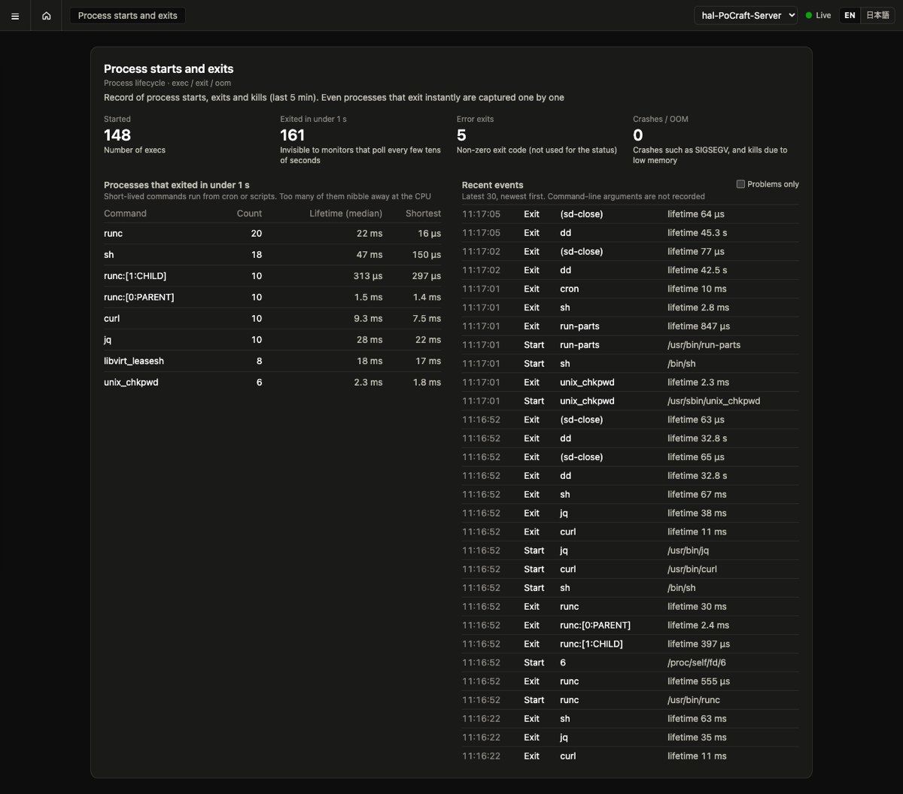


*What it is.* Every exec, exit, OOM kill and terminating signal on the host, from the kernel, including processes that live for a millisecond. Command-line arguments are deliberately **not** recorded (they can contain passwords).

*What you see.* Four tiles (starts, exits under 1 s, error exits, crashes + OOM), a table of abnormal endings, the most frequent short-lived commands (cron and script noise, but also fork bombs), and the raw event log with an "abnormal only" filter.

*Reading it.* An **OOM kill** row tells you the scope (host out of memory vs. a cgroup limit) and *which process's allocation triggered it* — often not the victim. A **crash** is an exit by SIGSEGV/SIGABRT/SIGBUS/SIGFPE/SIGILL/SIGSYS or with a core dump; SIGTERM/SIGKILL are not crashes, they are someone stopping the process. A **signal** row says who sent SIGTERM/SIGKILL/SIGINT/SIGHUP/SIGQUIT to whom.

### Memory (`/memory`)

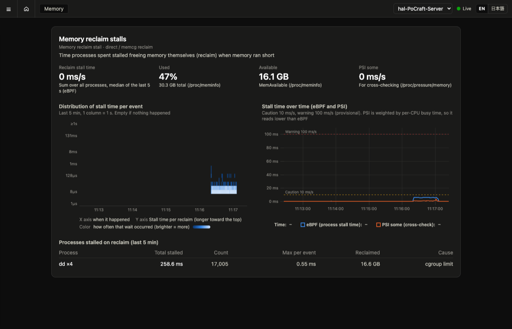


*What it is.* Time processes spend stalled in memory reclaim — the moment a process asks for memory and the kernel makes it wait while freeing some. Counted per process with eBPF (`direct reclaim` for a host-wide shortage, `memcg reclaim` for a cgroup limit). Usage and PSI come from `/proc` only to cross-check.

*What you see.* Tiles (stall ms/s, usage, available, PSI), a heatmap of stall lengths, a trend of eBPF stall vs. PSI, and the stalled processes with the cause (cgroup limit vs. host shortage).

*Reading it.* Usage alone is not a problem; stalling is. A process stalling under a **cgroup limit** is a container or VM at its own cap — the fix is its limit, not the host. Host-wide stalls mean the box is short. PSI reads lower than eBPF when only one process stalls while other CPUs stay busy; that is expected (PSI is weighted by CPU time), and the manual's rule of thumb is: trust the per-process number for *who*, PSI for *the machine as a whole*.

### VMs (`/vms` and `/vms/<name>`)

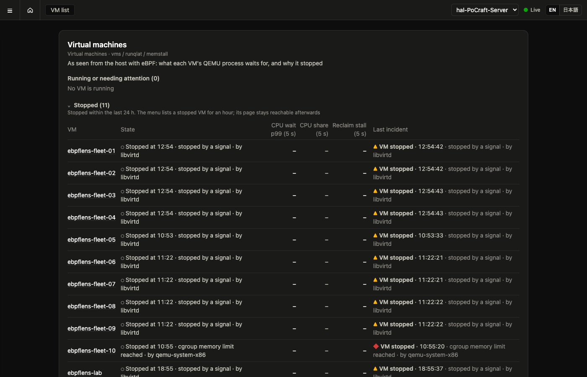


*What it is.* KVM guests seen from the host. eBPFLens recognises QEMU processes (libvirt and Proxmox naming), so each VM's CPU wait and reclaim stalls are filed under its name, and a VM's death is explained from host-side evidence. No agent inside the guest is needed for this; no libvirt access either.

*VM list.* Two sections: **Running** (plus VMs that need attention: a stop in the last 5 minutes, or waiting for host CPU now) and **Stopped (N)**, folded closed by default and opened with a click (it opens by itself when nothing runs). Each row: state (running since / stopped at · cause), host-side CPU wait p99, share of host CPU, reclaim stall, last incident.

*A VM's life after it stops.* The host cannot tell a stopped VM from a deleted one, so time decides: 5 minutes in the menu with its level mark, an hour under the menu's **Stopped (N)** fold, 24 hours in the list's stopped section, then gone from both — its page (`/vms/<name>`) still answers from the incidents the DB keeps for 30 days. A VM that starts again under the same name goes back to *running* and its earlier stops become the history on its page.

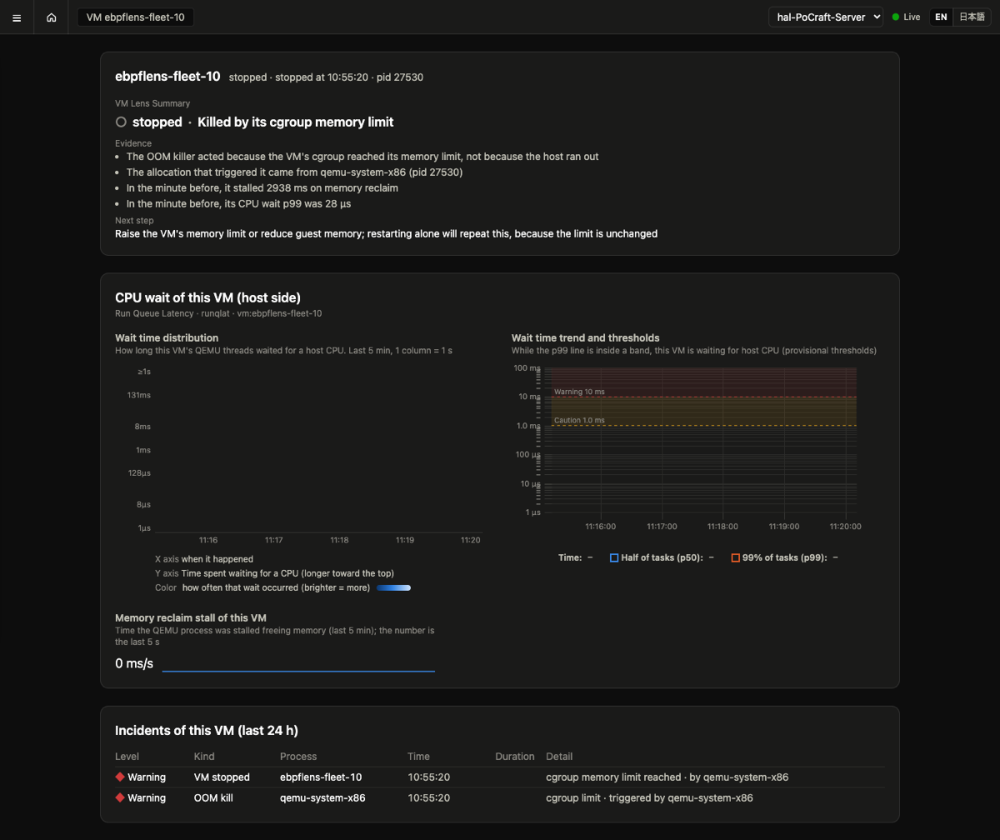

*VM page.* A **VM Lens Summary**:
- **Headline by cause** — *Killed by its cgroup memory limit*, *Killed by the host's OOM killer*, *QEMU crashed*, *Stopped by a signal*, *Exited cleanly*, or *Running*.
- **Evidence** — only facts that are present: who sent the signal, what allocation triggered the OOM and whether the limit was the VM's cgroup or the host, the signal and core dump, and the VM's last minute (reclaim stall, CPU wait p99).
- **Next step, with its reason** — e.g. *Raise the VM's memory limit or reduce guest memory; restarting alone will repeat this, because the limit is unchanged.*

Then the VM's own CPU-wait heatmap and trend (host side — this is steal time with a distribution), its reclaim stalls, and its incidents.


*Reading it.* A running VM whose wait p99 sits above 1 ms while its own CPU share is small is a **victim of noisy neighbours**; its `vm_cpu_wait` incident and the *Who took this VM's CPU* table name them. A VM that stalled in reclaim before dying was thrashing against a limit — with swap on the host, a limit makes a VM crawl rather than die.

### Disk (`/disk`)

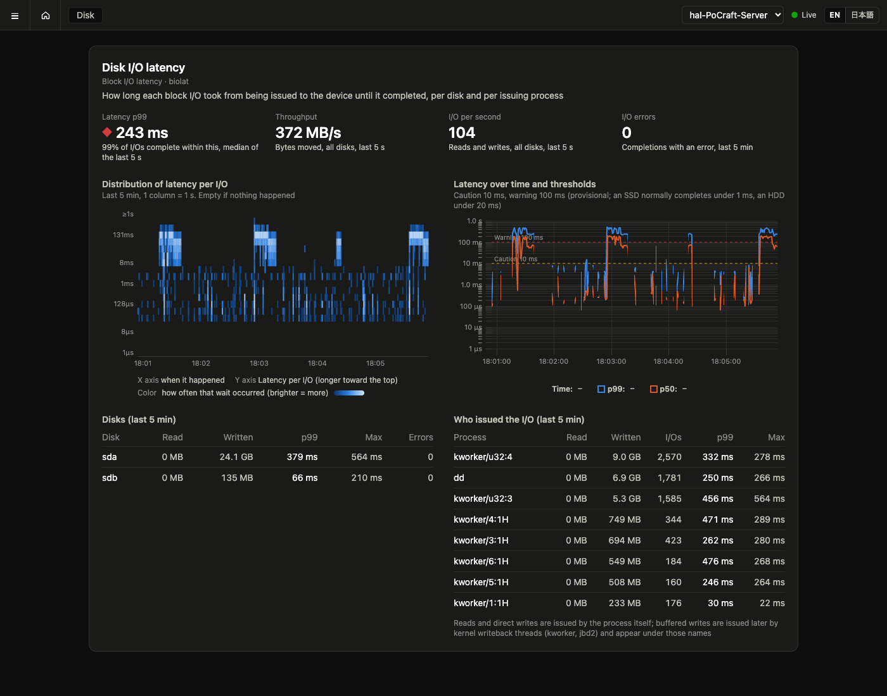

*What it is.* Every block I/O timed from the moment it is issued to the device until it completes (eBPF on the block tracepoints), kept three ways: as a latency histogram, per disk (I/Os, bytes, max latency, errors) and per issuing process.

*What you see.* Tiles (latency p99, throughput, I/O per second, errors), a heatmap of latency per I/O, the p50/p99 trend with the caution and warning lines, the disks, and who issued the I/O.

*Reading it.* The p99 is queueing plus device time. A rising p99 with one process issuing most of the bytes is that process saturating the disk — throttle or move it (ionice, a different disk, off-peak). A rising p99 with little traffic is the device itself: look at the errors column, then `dmesg` and SMART. Buffered writes are issued by kernel writeback threads (`kworker`, `jbd2`), so they appear under those names; reads and direct writes are attributed to the process. A sequential direct write at full speed shows a high p99 on its own because the queue is deep, not because the disk is failing — the thresholds are provisional and per host.

### Network (`/network`)


*What it is.* Outbound TCP as the socket state machine sees it: how long each connect took to establish, which connects failed, and which destinations needed retransmissions — per destination and per process.

*What you see.* Tiles (connects/s, connect p99, failed connects, retransmissions), a heatmap of connect time, the p50/p99 trend with the caution and warning lines, the destinations, and who connected.

*Reading it.* **Failed** connects are the other side or the path: refused (nothing listens there), unreachable, or timed out. **Retransmissions** to one destination are packet loss or congestion on that path; retransmissions to "clients at addr" are on connections *into* this host. A **connect p99 at 1 s or 3 s** is the tell-tale of loss: the initial SYN was dropped and retransmitted after the 1 s timeout (then 3 s), so a destination that is "slow" at exactly those values is lossy, not far. Retransmits are counted per destination only; the kernel does them without a process context.

*Dropped packets.* The last section lists every packet the kernel threw away, with the kernel's own reason, in three tiers: **housekeeping** (duplicate or stale segments, a socket closed with data queued — every connection produces these; counted only), **notable** (`NO_SOCKET`: a packet for a port nobody listens on, `TCP_RESET`...) and **trouble** (`TCP_LISTEN_OVERFLOW`: the accept queue is full, `NETFILTER_DROP`: a firewall rule, `IP_OUTNOROUTES`: no route, `QDISC_DROP`: a saturated interface, `NOMEM`...). Notable and trouble rows carry the source address, the destination address and port, the protocol, and — for a port a process started listening on while the agent was running — the **listener**. Hover a reason for its meaning. The Dropped packets tile counts the trouble tier only.

### DNS (`/dns`)


*What it is.* Name resolution as applications experience it: a uprobe on glibc's `getaddrinfo` records each lookup's name, how long the call took, and its result. `/etc/hosts`, the local cache and upstream retries are all inside the time.

*What you see.* Tiles (lookups/s, lookup p99, failed lookups, distinct names), a heatmap of lookup time, the p50/p99 trend with the caution and warning lines, the names (with the error of the last failure), and who looked them up.

*Reading it.* **No such name** (`EAI_NONAME`) is a wrong or retired name, or a missing record — fix the configuration or the zone. **No answer in time** (`EAI_AGAIN`) is a DNS server that is down or unreachable. A local cache answers in about 1 ms and an upstream server in tens of ms; a p99 of **seconds** is a server that did not answer and was retried. Programs that resolve without glibc (Go's built-in resolver, musl in containers) are not seen.

### Files (`/files`)

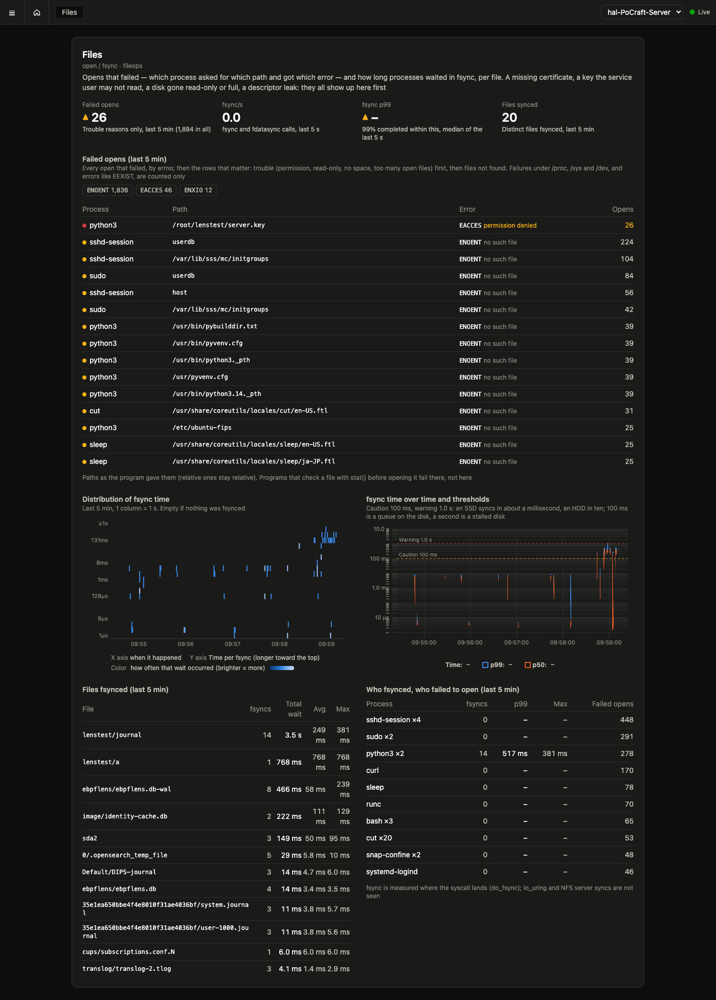

*What it is.* Two things about files seen from inside the kernel: opens that failed (the raw syscall tracepoints for `open` / `openat` / `openat2`: process, path, errno) and fsync waits (`do_fsync`: how long, per process and per file).

*What you see.* Tiles (failed opens of the trouble tier, fsync/s, fsync p99, distinct files fsynced), the failed opens by errno as chips and as rows (trouble first, then files not found), a heatmap of fsync time, the p50/p99 trend with the caution and warning lines, the files fsynced, and who fsynced or failed to open.

*Reading it.* The **error names the fix**: `EACCES` / `EPERM` is ownership, mode or AppArmor (`ls -l`, the service user); `EROFS` is a mount that went read-only (`dmesg`); `ENOSPC` is a full disk; `EMFILE` / `ENFILE` is a descriptor leak or limit (`ls /proc/<pid>/fd | wc -l`). `ENOENT` rows are shown because "nginx cannot find /etc/ssl/certs/x.pem" belongs on the screen, but they never open an incident: programs look for optional files all day long. Failures under `/proc`, `/sys` and `/dev` are only counted. An **fsync p99** of 100 ms is a queue on the disk and a second is a stalled disk; the files table says which file took the time, and the disk screen at the same moment says why the disk was slow.

### Locks (`/locks`)

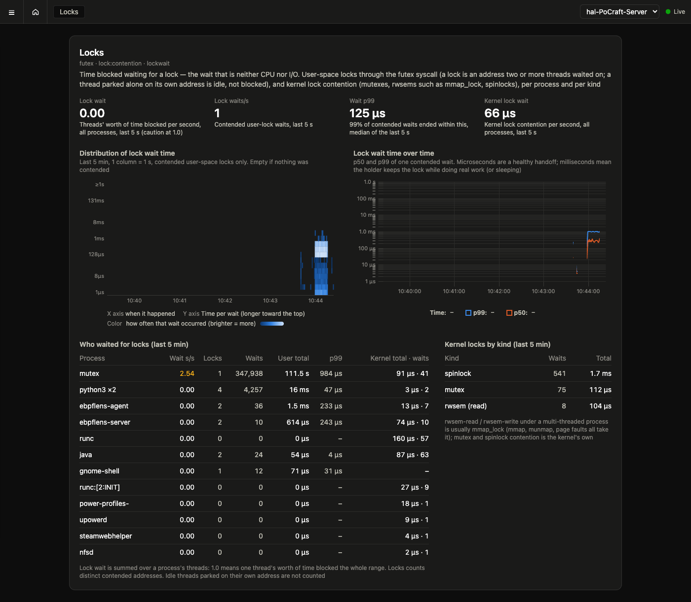

*What it is.* Time blocked waiting for a lock — the wait that is neither CPU nor I/O. User-space locks through the futex syscall (an address two or more threads waited on is a lock; a thread parked alone on its own address is idle, not blocked), and kernel lock contention (mutex, rwsem, spinlock) per process and per kind.

*What you see.* Tiles (lock wait in threads' worth of time per second, contended waits per second, wait p99, kernel lock wait), a heatmap and the p50/p99 trend of one contended wait, who waited (with the split between user and kernel locks and the number of distinct contended locks), and kernel locks by kind.

*Reading it.* **Wait s/s** is the number to read: 1.0 means one thread's worth of time blocked the whole range; a process at 7.0 has seven threads waiting at any moment, and more CPUs will not help it. Microsecond waits at a high rate are a lock handed around briskly (CPython's GIL: 270,000 a second at ~5 µs); millisecond waits mean the holder does real work, or sleeps, while holding it. **rwsem-read / rwsem-write** under a multi-threaded process is usually `mmap_lock`: mmap, munmap and page faults all take it, so many threads allocating at once contend on it.

### GPU (`/gpu`)

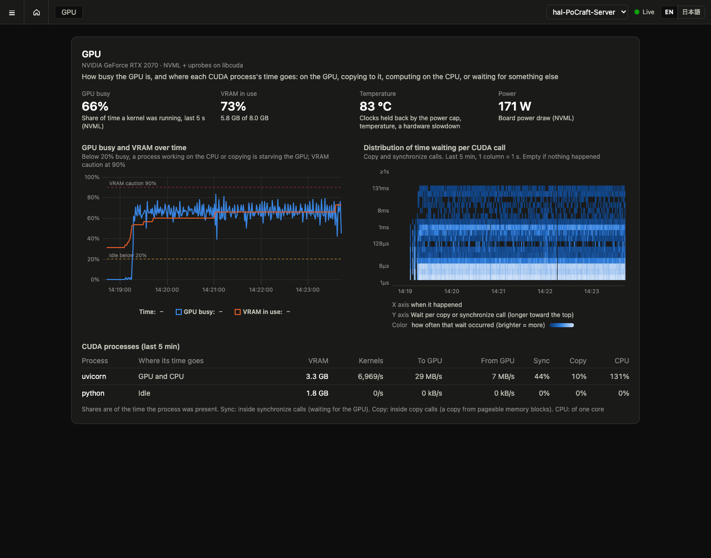

*What it is.* The GPU seen from both sides: the device through NVML (utilization, VRAM, temperature, power, clock throttling — the one source in eBPFLens that is not eBPF, because the kernel does not know what the GPU does), and each CUDA process through uprobes on `libcuda`: kernel launches, bytes copied each way, time blocked inside copy calls, time waiting in synchronize calls, plus its CPU time from runqlat. Container processes are included.

*What you see.* Tiles (GPU busy, VRAM, temperature with the throttle reason, power), GPU busy and VRAM over time with the idle line and the VRAM caution line, a heatmap of how long each copy or synchronize call waited, and the CUDA processes with a **verdict** on where their time goes.

*Reading it.* Start from the verdict. *GPU-bound* is the good case — the GPU is the bottleneck and the process waits for it. *Transfer-bound* means the process spends its time inside copy calls: it is copying from pageable host memory (each call blocks) or in small batches — pinned memory or larger batches help. *GPU and CPU* means the GPU is busy only part of the time and the process computes on the CPU the rest: preprocessing, tokenizing or Python overhead is the next limit. *CPU-bound* is the same with the GPU nearly idle. *Waiting elsewhere* means the process is neither on the CPU nor in a CUDA call — it waits for I/O, a lock, or its input. *Idle* is a loaded model with no requests, holding VRAM. A temperature tile that says the clocks are held back explains a GPU that is "busy" yet slow.

### History (`/history`)


*What it is.* The last 1, 6 or 24 hours from the server's DB, one row per area: the incidents of that area as bands in their level's color, and the area's key value as a line (CPU wait p99, reclaim stall, VMs running, disk p99, retransmits/s, DNS p99, GPU busy). Samples are folded into a few hundred points on the server, so histograms still give true percentiles per point.

*What you do with it.* Find **when** and **where** — "at 03:05 the disk band and the DNS band light up together" — then **click that moment on that row**: the area's own screen opens for the 5 minutes around it (`/disk?at=…`), from the DB, at full one-second detail, with a banner saying so and links back to live and to the history. The incident list below is limited to the range.


*Limits.* The DB keeps one-second samples for 24 hours (`-retention`), so that is as far back as the history reaches for now; the 24-hour view takes a few seconds to read. The tiles on a past screen ("last 5 s", "last 5 min") refer to the end of the shown window. The dashboard, the settings and the history itself are always live.

### All panels (`/all`)

Every panel from the screens above on one long page, with jump links. For when you want to scroll rather than click.

## 5. Incidents: what each kind means and what to do

Incidents are decided **on the server** by fixed rules (the thresholds are a JSON file, see §8). Levels never go down while an incident is open; the peak tells the story. An incident that was open when the server restarted is shown as closed at its last update — the server does not pretend to know what happened while it was down.

| Kind | Opens when | Level | Closes when | What it means / what to do |
|---|---|---|---|---|
| **CPU contention** (`cpu_wait`) | run-queue p99 ≥ 1 ms for 3 s | caution; warning once ≥ 10 ms for 3 s | p99 below 1 ms for more than 2 s | Tasks wait for CPUs. Open the CPU screen: the *cause* table names the hog; the *impact* table names who paid. Throttle or move the hog; do not add CPUs before knowing who eats them. |
| **Memory reclaim stall** (`mem_stall`) | ≥ 10 ms/s stalled for 3 s | caution; warning once ≥ 100 ms/s | below 10 ms/s for more than 2 s | Processes freeze while the kernel frees memory. The memory screen says who and whether it is a cgroup limit (fix the limit) or the host (free memory or add it). |
| **OOM kill** (`oom_kill`) | the kernel killed a process | warning | instant | Evidence: victim, trigger process, host vs. cgroup. If the trigger is not the victim, the trigger is where to look. |
| **Crash** (`crash`) | exit by a crash signal or with a core dump | caution | instant | A software fault. Check the process's own logs / core dump. |
| **Crash loop** (`crash_loop`) | the same command crashes 3 times in 5 min | warning | 5 min after the last crash | Something restarts it into the same failure. Stop the restart loop, then fix the crash. |
| **Agent stopped reporting** (`agent_down`) | no sample for 30 s | warning | the host reports again | The host, the network, or the agent is down — nothing else on this host is fresh. Check the host first. |
| **VM waiting for CPU** (`vm_cpu_wait`) | a VM's host-side wait p99 ≥ 1 ms for 3 s | caution; warning once ≥ 10 ms for 3 s | below 1 ms for more than 2 s | The VM is losing time to neighbours. The incident names who took the CPU (a group, see below); the VM page says what to do. |
| **VM stopped** (`vm_down`) | a VM's QEMU process exited | warning for OOM / crash; caution for killed / clean exit | instant | Open the VM page: cause, evidence and next step are there. |
| **GPU idle while its process works elsewhere** (`gpu_starved`) | the GPU below 20 % busy while a CUDA process is ≥ 50 % busy on the CPU or inside copy calls, for 10 s | caution; warning at ≥ 90 % | the GPU gets busy, or the process quiets down, for more than 5 s | The GPU is waiting for the process, not the other way round. The incident says which: on the CPU (preprocessing, tokenizing, Python) or copying (pageable memory, small batches). Fix that side; a bigger GPU will not help. |
| **Slow disk I/O** (`disk_slow`) | block I/O latency p99 ≥ 10 ms for 3 s | caution; warning once ≥ 100 ms for 3 s | below 10 ms for more than 2 s | The disk is slower than it should be, or a queue is building. The incident names who issued most of the bytes (group rule as for CPU). If nobody stands out and traffic is low, suspect the device. |
| **Disk I/O error** (`disk_error`) | a block device completed I/O with an error | warning | instant | Check `dmesg` and SMART for that device now; an error is the first sign of a failing disk or a bad cable. |
| **TCP connects failing** (`net_connect_fail`) | ≥ 5 failed connects in the last 10 s, falling in at least 3 of those seconds (a one-second burst — a check trying a dozen unreachable IPv6 addresses before falling back to IPv4 — is not an outage) | caution; warning at ≥ 50 | fewer than 5 in 10 s for more than 10 s | Names the destinations that took most of the failures. Refused means nothing listens (the service is down or the port is wrong); unreachable or timed out means the path or a firewall. |
| **TCP connects slow** (`net_connect_slow`) | connect p99 ≥ 200 ms for 3 s | caution; warning at ≥ 1 s | below 200 ms for more than 5 s | At 1 s the SYN itself was retransmitted: packets to that destination are being lost. Below that, a slow path or an overloaded peer. |
| **Packets dropped by the kernel** (`net_drop`) | ≥ 10 packets dropped for a trouble reason in the last 10 s, in at least 3 of those seconds | caution; warning at ≥ 100 | fewer than 10 in 10 s for more than 10 s | Names the reason and the destination that took most of them (`TCP_LISTEN_OVERFLOW 192.168.10.250:8099 (python3)`), or the reason alone when no flow stands out. The reason names the fix: LISTEN_OVERFLOW is the listening process not accepting fast enough (more workers, a bigger backlog); NETFILTER_DROP a firewall rule (`nft list ruleset`); *NOROUTES / NEIGH_* the routing (`ip route`, the gateway); QDISC_* / CPU_BACKLOG a saturated interface or CPU; *MEM memory. Housekeeping drops never count. |
| **TCP retransmissions** (`net_retrans`) | ≥ 10 retransmitted segments/s for 3 s | caution; warning at ≥ 100/s | below 10/s for more than 5 s | Packet loss or congestion toward the named destinations; "clients at addr" means the loss is on connections into this host. Check the link, the switch port, and the peer. |
| **Name lookups failing** (`dns_fail`) | ≥ 5 failed `getaddrinfo` calls in the last 10 s, in at least 3 of those seconds | caution; warning at ≥ 50 | fewer than 5 in 10 s for more than 10 s | Names the names and the error; when no single name stands out, the parent domain (`*.internal.example (NONAME)`). *No such name*: fix the name or the record. *No answer in time*: the DNS server. |
| **File opens failing** (`file_fail`) | ≥ 5 opens failed for a trouble errno (EACCES, EPERM, EROFS, ENOSPC, EDQUOT, EMFILE, ENFILE, EIO, ETXTBSY, ESTALE; not under /proc, /sys, /dev) in the last 10 s, in at least 3 of those seconds | caution; warning at ≥ 50 | fewer than 5 in 10 s for more than 10 s | Names `process path (ERRNO)`, or `process (ERRNO)` when one process fails on many files. ENOENT never counts (it is shown on the files screen). The errno names the fix: permission → owner / mode / service user; EROFS → `dmesg`, the mount remounted read-only; ENOSPC → free space; EMFILE → a descriptor leak. |
| **fsync slow** (`fsync_slow`) | fsync p99 ≥ 100 ms for 3 s | caution; warning at ≥ 1 s | below 100 ms for more than 5 s | Names the files that took most of the fsync time. Check the disk screen for the same moment: a slow device or a queue (a backup's writeback in front of a database's commits). |
| **Waiting for locks** (`lock_wait`) | a process's lock wait (user + kernel, summed over its threads) ≥ 1.0 s per second for 3 s | caution; warning at ≥ 4.0 | below 1.0 for more than 2 s | Names the process and splits the wait between its own locks and the kernel's. Do not add CPUs: the work serializes on a lock. Find it (`perf lock contention`, py-spy, async-profiler, Go's mutex profile), shorten what is done while holding it, split it, or use fewer threads. |
| **Name lookups slow** (`dns_slow`) | lookup p99 ≥ 100 ms for 3 s | caution; warning at ≥ 1 s | below 100 ms for more than 5 s | Check `resolvectl status` and the upstream server; seconds mean a server that did not answer and was retried. |
| **VRAM nearly full** (`vram_full`) | ≥ 90 % of VRAM in use for 3 s | caution; warning at ≥ 97 % | below 90 % for more than 2 s | The next large allocation will fail and kill the job. The GPU screen says which process holds the VRAM. |


**Who took the CPU.** `cpu_wait` and `vm_cpu_wait` incidents carry the *culprit group*: the processes or VMs using ≥ 10 % of the host each, largest first, at most five, and only if together they used ≥ 50 % (a waiting VM is never its own culprit). One hog is a group of one; three neighbours at ~25 % are a group of three; a CPU shared evenly by many is "no single process or small group" — the incident then says how busy the host was instead of guessing.

`vm_down` causes:

| Cause | Evidence | Next step (and why) |
|---|---|---|
| `cgroup_oom` | OOM kill inside the VM's own cgroup, with the triggering process | Raise the VM's memory limit or reduce guest memory; a restart alone repeats it because the limit is unchanged. |
| `host_oom` | OOM kill machine-wide | The host is overcommitted; free host memory before restarting or it may happen again. |
| `crash` | QEMU ended on a crash signal / core dump | Restart it; a QEMU crash is not the guest's fault — check the QEMU log and core dump. |
| `killed` | a terminating signal was sent to QEMU, with who sent it | If that was not intended, restart it. *libvirtd* as the sender covers both a guest shutdown and a `virsh destroy` (§7). |
| `shutdown` | exit 0 with no signal seen | A clean exit; restart if unintended. |

## 6. Notifications

`ebpflens-server -webhook URL` posts one line per **transition** — open, escalate, close — never progress updates. `-webhook-format generic` sends `{event, text, incident}`; `slack` sends `{text}`; `discord` sends `{content}`. Lines look like:

```
[WARNING] hal: processes are competing for CPU (99% of tasks waited up to 16.3 ms, 3 s since 09:01:34)
[RESOLVED] hal: processes are competing for CPU (99% of tasks waited up to 16.3 ms, 21 s since 09:01:34)
[WARNING] hal: flaky-app is crashing repeatedly (3 times since 09:02:00)
[WARNING] hal: host stopped reporting (last sample at 09:02:09, silent for 30 s)
[WARNING] hal: VM web-02 stopped at 09:55:38: its cgroup memory limit was reached; triggered by libvirtd (pid 2002). In the minute before: 1188 ms stalled in memory reclaim, CPU wait p99 29 µs
```

Delivery is asynchronous with one retry; a dead webhook never blocks the agents.

## 7. What eBPFLens cannot see, and other limits

- **No authentication.** Anyone who can reach the server can read everything and post fake samples. Run it on a trusted network only.
- **A guest shutdown and a `virsh destroy` look the same from the host.** libvirt runs QEMU with `-no-shutdown` and sends SIGTERM itself in both cases, and QEMU exits 0 on SIGTERM. Telling them apart needs libvirt's own stop reason, which is not read yet.
- **A culprit group needs members at ≥ 10 % each adding up to ≥ 50 %.** A CPU shared evenly by many small processes yields no culprit; the incident then reports the host's busy share instead.
- **Per-process tables are top-N.** The agent sends the top 8 by wait and by CPU each second (VMs always). Totals over long ranges are therefore approximate; the screens say so.
- **A host-wide OOM of a VM** has been reproduced only in unit tests on recorded event shapes, not live.
- **Thresholds are provisional**, chosen from one 8-core machine. Tune them (§8) to your hosts.
- **Buffered writes are attributed to the kernel's writeback threads** (`kworker`, `jbd2`), not to the process that wrote; reads and direct writes are attributed to the process. Disk latency includes queueing time, so a saturated disk reads as slow even when healthy.
- **Retransmissions are per destination only** (no process: the kernel retransmits without one), and inbound connections are folded into one row per client address. Connects and retransmissions are TCP only; dropped packets cover every protocol.
- **The listener of a dropped packet is known only for TCP ports that entered LISTEN while the agent was running.** A service that was already listening when the agent started shows no listener until it listens again (the agent starts at boot before most services, so this mostly matters after an agent restart). The tiers of drop reasons are a fixed table; a reason the table does not know is shown as housekeeping.
- **Failed opens are seen at `open` / `openat` / `openat2` only.** A program that checks a file with `stat()` before opening it (Rust coreutils' `cat`, many shells) fails there, not here. Paths are as the program gave them: relative paths stay relative, and the first 95 bytes are kept. fsync is measured at `do_fsync` (the syscalls); io_uring and NFS server syncs are not seen.
- **Lock waits are told apart from parking by the number of waiters per futex address.** A lock that only ever has one waiter at a time (two threads handing it back and forth very politely) looks like parking and is not counted; a condition variable with many waiters uses a different futex operation and is skipped on purpose. Kernel lock contention needs the `lock:contention_*` tracepoints (5.19+); without them the user-space half still works.
- **DNS is measured at glibc's `getaddrinfo`**: programs that resolve without glibc (Go's built-in resolver, musl in containers) are not seen, and names are kept to their first 63 bytes.
- **Only the first GPU is watched**, and per-process GPU utilization is not available on GeForce cards (NVML returns Not Found), so the verdict reasons from what the process was doing (CPU, copies, synchronize) and how busy the device was. The uprobes need kernel 6.6+ (multi-uprobe BPF links); on an older kernel the GPU screen shows the device only.
- **Linux only.** macOS has no eBPF; a best-effort macOS agent is planned, not built.
- **Windows is not planned** unless there is demand.
- **The dashboard shows the last 5 minutes of samples and 24 hours of incidents.** The DB keeps samples 24 h, events 7 days, incidents 30 days; there is no long-range history screen yet.

## 8. Configuration and API quick reference

### The settings screen (`/settings`)

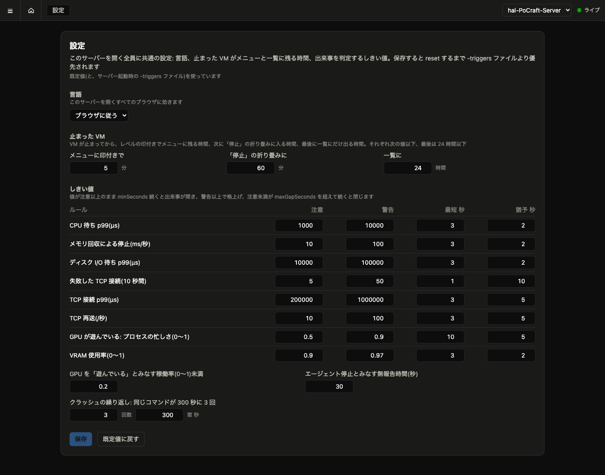

Everything below can also be changed from the menu's **Settings** screen, for every browser at once: the **language** (follow the browser, EN, or Japanese — the header switch is gone, this is the only place), how long a **stopped VM** stays in the menu with its mark, under the Stopped fold, and in the list, and every **threshold** the incidents are judged with. *Save* writes the values to the server's DB and they apply at once — charts redraw their bands, and open incidents are judged against the new numbers from the next sample. *Reset to defaults* drops the saved copy. Precedence: built-in defaults ← the `-triggers` file at startup ← what was saved from the screen. Without a `-db`, a save lasts until the server restarts.

Server:

| Flag | Default | Meaning |
|---|---|---|
| `-addr` | `:8080` | listen address |
| `-db` | (none) | SQLite file; empty disables persistence |
| `-keep` | 900 | samples kept in memory per host × probe (the UI window) |
| `-keep-events` | 20000 | events kept in memory per host |
| `-retention` / `-event-retention` / `-incident-retention` | 24h / 168h / 720h | DB retention |
| `-triggers` | (defaults) | JSON file over the default thresholds; `-print-triggers` prints them |
| `-webhook` / `-webhook-format` | (none) / `generic` | notifications |

Agent: `-server URL`, `-host NAME`, `-interval 1s`, `-top 8`, `-text` (human-readable output), `-count N`.

Trigger file (values shown are the defaults):

```json
{
  "cpu":       {"caution": 1000, "warning": 10000, "minSeconds": 3, "maxGapSeconds": 2},
  "memory":    {"caution": 10,   "warning": 100,   "minSeconds": 3, "maxGapSeconds": 2},
  "processes": {"crashLoopCount": 3, "crashLoopWindowSeconds": 300},
  "agentDown": {"afterSeconds": 30},
  "gpu":       {"idleUtil": 0.2,
                "starved": {"caution": 0.5,  "warning": 0.9,  "minSeconds": 10, "maxGapSeconds": 5},
                "vram":    {"caution": 0.9,  "warning": 0.97, "minSeconds": 3,  "maxGapSeconds": 2}},
  "disk":      {"caution": 10000, "warning": 100000, "minSeconds": 3, "maxGapSeconds": 2},
  "network":   {"connectFails":   {"caution": 5,      "warning": 50,      "minSeconds": 1, "maxGapSeconds": 10}, "failSpreadSeconds": 3,
                "connectLatency": {"caution": 200000, "warning": 1000000, "minSeconds": 3, "maxGapSeconds": 5},
                "retrans":        {"caution": 10,     "warning": 100,     "minSeconds": 3, "maxGapSeconds": 5},
                "drops":          {"caution": 10,     "warning": 100,     "minSeconds": 1, "maxGapSeconds": 10}},
  "dns":       {"fails":   {"caution": 5,      "warning": 50,      "minSeconds": 1, "maxGapSeconds": 10}, "failSpreadSeconds": 3,
                "latency": {"caution": 100000, "warning": 1000000, "minSeconds": 3, "maxGapSeconds": 5}},
  "files":     {"fails":        {"caution": 5,      "warning": 50,      "minSeconds": 1, "maxGapSeconds": 10}, "failSpreadSeconds": 3,
                "fsyncLatency": {"caution": 100000, "warning": 1000000, "minSeconds": 3, "maxGapSeconds": 5}},
  "locks":     {"caution": 1.0, "warning": 4.0, "minSeconds": 3, "maxGapSeconds": 2}
}
```

API (all `GET` unless noted): `/api/history?host=&probe=&from=&to=&bucket=` (from/to in Unix ms, bucket in seconds; 1 = raw samples, at most 30 minutes), `/api/history/events?host=&from=&to=`, `/api/settings` (`PUT` replaces, merging a partial document such as `{"ui":{"lang":"ja"}}` into the current one; `DELETE` resets), `/api/hosts`, `/api/samples?host=&probe=runqlat|memstall|vms|gpu|biolat|tcpconn|dnslat`, `/api/events?host=`, `/api/incidents?host=` (newest first; ongoing ones have no `end`), `/api/triggers`, `/api/stream?host=` (SSE: `sample`, `events`, `incident`); agents `POST /api/ingest` and `/api/events`.

## 9. Glossary

- **Run-queue latency (CPU wait)** — time between a task becoming runnable and actually running on a CPU. The saturation signal for CPUs.
- **p50 / p99** — the value half / 99 % of measurements stay under. p99 is what the unlucky requests see.
- **Reclaim stall** — a process paused while the kernel frees memory on its behalf (direct or cgroup reclaim).
- **PSI** — the kernel's Pressure Stall Information (`/proc/pressure/*`): machine-wide productive time lost; lower than per-process stall when only one process stalls.
- **OOM kill** — the kernel killing a process for lack of memory, machine-wide or inside a cgroup.
- **cgroup** — the kernel's resource-limit grouping; containers and VMs each live in one.
- **Steal** — CPU time a VM wanted but the host gave to someone else; eBPFLens shows it as the VM's host-side run-queue wait.
- **Incident** — one thing the rules judged wrong, with its evidence, start, end and level.
